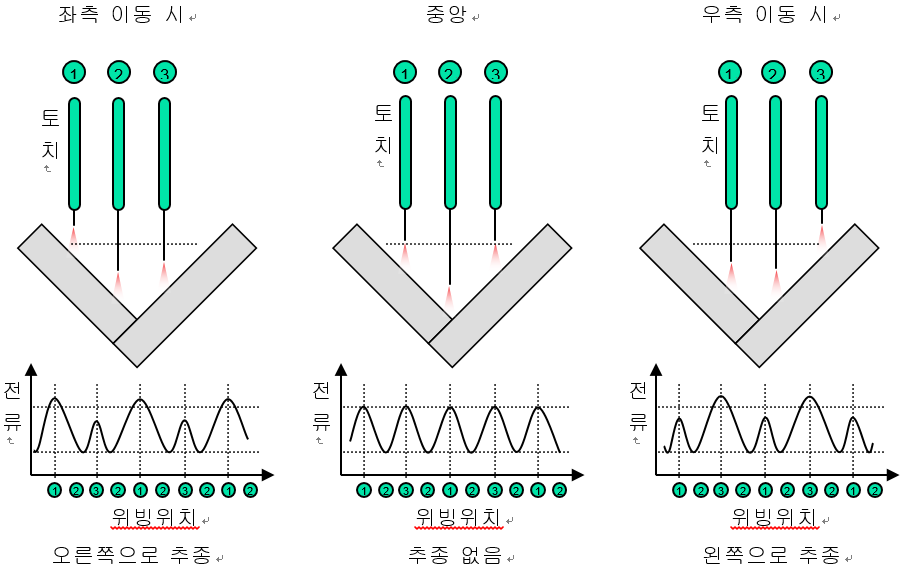
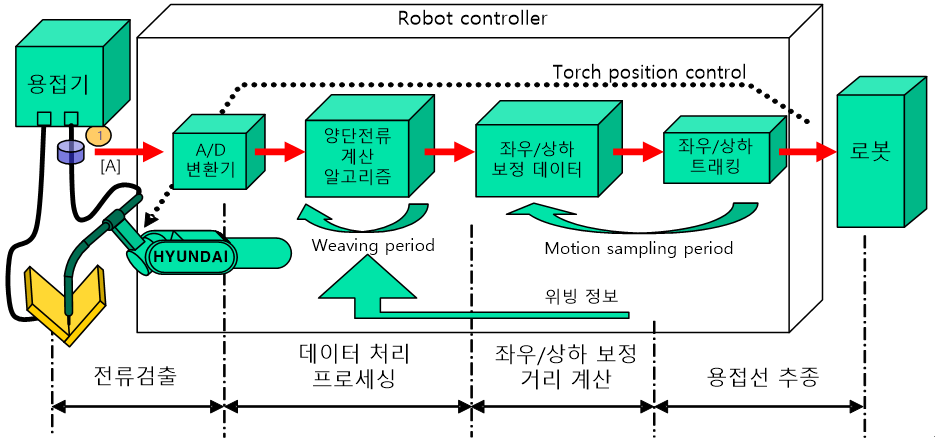

# 1.3 아크센싱의 원리

아크용접 시 위빙을 하면 토치와 모재 사이의 거리에 변화가 생기게 되고 거리변화만큼의 저항이 변하여 흐르는 전류가 변합니다. 
즉 위빙구간의 전류 변화로부터 양단의 거리를 산출하면 위빙 면에서의 좌우 방향으로 보정할 거리를 계산할 수 있어서 용접선을 추종할 수 있습니다. 
또한 용접시작위치는 터치센싱에 의해 상하방향의 오차가 거의 없으므로 이 값을 기준으로 위빙 중간 부분의 전류평균값을 비교하여 상하방향을 보정할 수 있습니다. 
아크센싱 중 별도의 높이 조절이 필요한 경우 시작 위치에서 전류평균값 대신 직접 입력한 전류값을 기준으로 상하방향을 보정할 수도 있습니다.

 </img>
 <em>
그림 1.2 아크센싱 시 토치 위치와 전류의 관계
</em>

아크센싱에 의한 용접선 추종 과정은 다음 그림과 같습니다.

 </img>
 <em>
그림 1.3 아크센싱 프로세스
</em>

