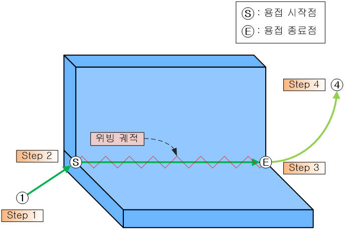
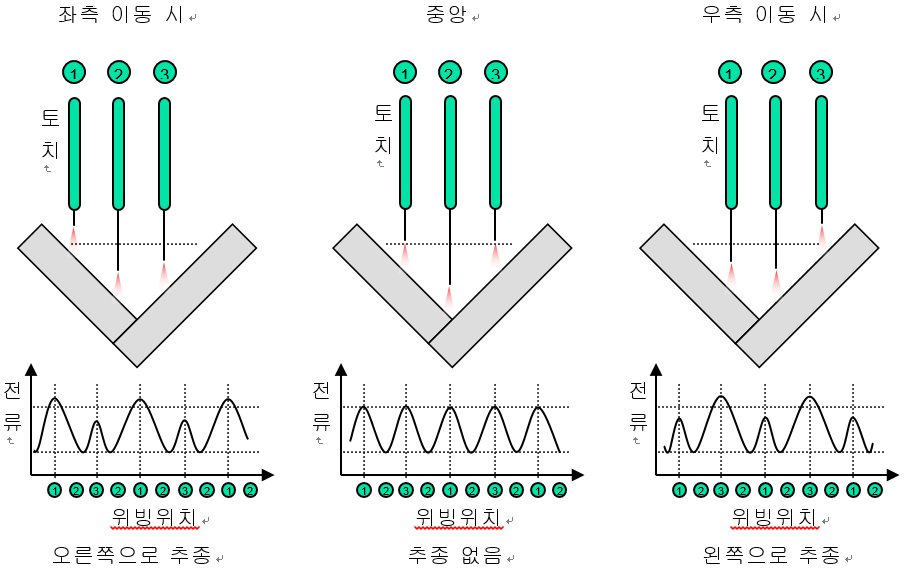
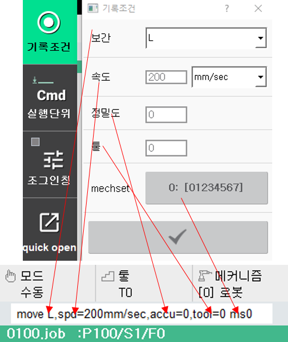
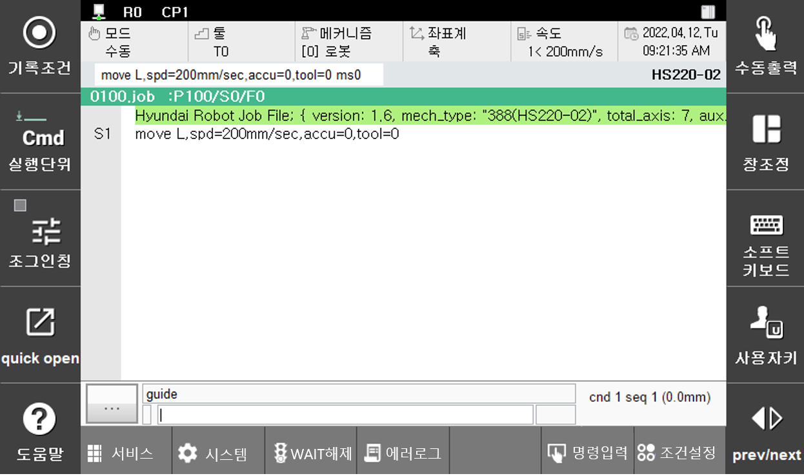
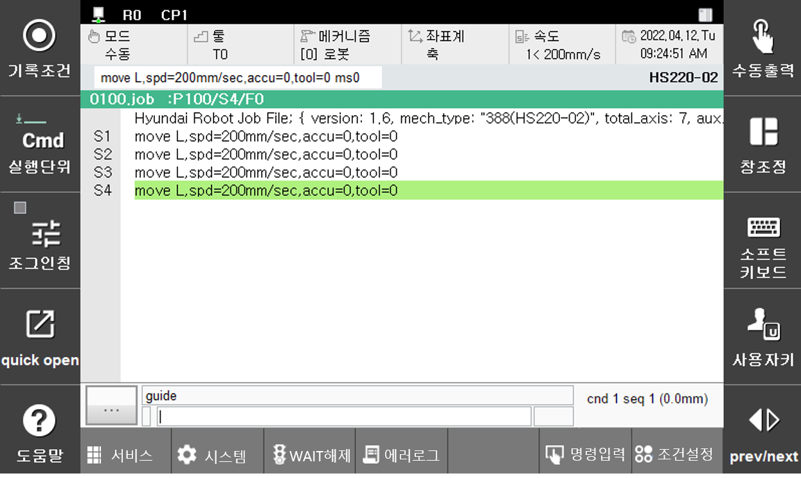
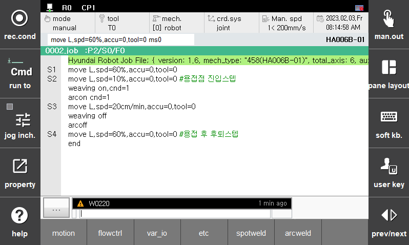

# 1.1 개요

다음 그림과 같은 Arc용접 작업을 티칭 합니다.

 </img>
 <em>
그림 1.1 기본 Arc 용접 티칭
</em>

 

(1)	제어기 전면부의 전원 스위치를 켭니다.

(2)	티치펜던트의 [모드] 스위치를 수동모드로 선택합니다.

(3)	티치펜던트의 [프로그램]을 누른 후 프로그램 번호를 입력합니다.

(4)	여기까지 진행하면 티치펜던트 화면은 아래 그림과 같이 표시됩니다.

 </img>
 <em>
그림 1.2 신규 프로그램 번호가 선택된 화면
</em>

 

(5)	티치펜던트의 [Motor On] 버튼을 눌러 로봇의 모터에 전원을 투입합니다.

(6)	축 조작키를 사용해 로봇의 토치를 스텝1의 위치로 이동합니다.

(7)	[기록조건] 키를 누른 후 원하는 보간 종류, 속도, accuracy, 툴 번호를 지정합니다.  
            
- 방향키를 이용하여 원하는 항목으로 이동 후 값을 설정하고 [ENTER] 키를 누르면 설정이 저장됩니다.
- 툴 번호는 [툴] 키를 누른 후 원하는 툴 번호를 입력합니다. ([툴]키는 [SHIFT] + [좌표계]키를 눌러 선택합니다.) 

 </img>
 <em>
그림 1.3 기록조건 표시내용
</em>

 

- [기록]키를 누르면 아래 그림과 같이 스텝이 기록됩니다.

 </img>
 <em>
그림 1.4 스텝 기록 화면 (1)
</em>

 

(8)	스텝2~4에 대해서도 (5) ~ (7)의 과정을 반복합니다. 

 

 </img>
 <em>
그림 1.5 스텝 기록 화면 (2)
</em>

(9) 용접구간이 스텝2 ~ 스텝3이므로, 스텝2로 커서를 이동합니다. 

- [명령입력]-[아크용접]-[weaving]을 입력, 조건번호를 입력하고 [ENTER]키를 누릅니다.
- 같은 방법으로 [ARCON]키를 누릅니다. 조건번호를 입력하고 [ENTER]키를 누릅니다.
      (Arc용접 조건설정은 ‘5장 Arc용접 조건 편집’을 참고하십시오.)
 

(10) Arc용접이 종료되는 스텝인 스텝3으로 커서를 이동합니다.
 
- 다시 [명령입력]-[아크용접]-[arcon]을 입력하고off로 설정합니다.
- 같은 방법으로 [weaving]을 입력하여 off로 설정합니다.

(11) 스텝3의 속도를 원하는 용접속도로 수정합니다. (Ex. 12mm/s)

(12) 마지막으로 프로그램을 종료하는 END 명령을 입력합니다.
[명령입력] → [FLOW제어] → [END]키를 누르면 END 명령이 입력됩니다.

 </img>
 <em>
그림 1.6 티칭이 완료된 화면
</em>

