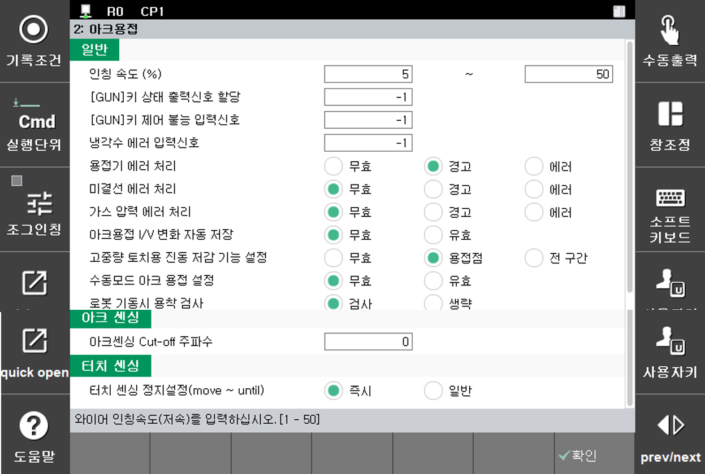

# 1.2.2 Arc 용접 각종 신호 및 기능 설정

수동모드 화면에서 『시스템』 → 『4: 응용 파라미터』 → 『2: 아크용접』을 누르면 다음 화면과 같이 Arc용접의 응용을 위한 각종 조건들을 설정할 수 있는 화면이 나타납니다.

 

 </img>
 <em>
그림 1.8 Arc용접 응용조건 대화상자
</em>

 

각 항목별 내용은 다음과 같습니다.

(1)	Inching속도 설정 : 저속[1 ~ 50] %, 고속[10~100] %  
Inching 속도 설정은 [SHIFT]+[2]\(인칭), [SHIFT]+[3]\(역인칭)키를 사용한 와이어의 인칭 및 역인칭 실행 시 와이어 송급 속도입니다. 저속 및 고속(3초 이상 키를 누르고 있을 때) 동작 시 송급 속도를 설정합니다.

(2)	[GUN]키 상태 출력신호할당 : [일반 출력신호 할당]
티치펜던트 [GUN]키의 현재 상태를 출력하기 위한 신호를 설정합니다.

(3)	[GUN]키 설정 입력신호할당 : [일반 입력신호 할당]  
외부에서 [GUN]키의 on/off를 설정할 수 있는 입력신호를 할당합니다. 해당 신호가 할당되면 티치펜던트의 [GUN]키를 눌러 아크용접 on/off상태를 변경할 수 없습니다. 이 기능을 이용하면 사용자 실수로 [GUN]키를 눌러 용접구간에서 용접을 하지 않는 문제를 방지할 수 있습니다([GUN]키의 LED가 꺼진 상태에서 로봇이 재생되는 경우 Arc 용접 구간에서 용접을 수행하지 않는 ‘Dry Run’상태로 진행). 할당된 신호가 입력되면 [GUN]키의 LED가 off되며 로봇이 재생되는 경우 ‘Dry Run’상태로 작업이 진행됩니다.

(4)	냉각수 상태 입력포트 할당 : [일반 입력신호 할당]  
수냉식 Arc용접 토치를 사용하는 경우 냉각수 순환에 문제 발생 상태를 입력 받기 위한 신호를 설정합니다. 용접 중 본 신호가 입력되면 에러로 판단하여 로봇 기동과 용접 작업을 정지합니다.

(5)	용접기 에러처리: [무효, 경고, 에러]  
용접기 에러를 처리하는 방법을 설정합니다.

(6) 미결선에러처리: [무효, 경고, 에러]  
용접 와이어가 없을 때 에러처리 방법을 설정합니다.

(7)	가스 압력상태 입력 : [무효, 정논리, 부논리]    
가스 압력상태를 입력 받는 신호의 사용여부와 논리를 설정합니다.

(8)	Arc 용접 전류/전압 변경 자동저장 설정 : [무효, 유효]  
‘Arc용접 전류전압 변경’대화상자에서 전류와 전압 값을 변경할 경우 그 값을 자동 저장할 것인지 여부를 결정합니다. 자세한 내용은 [[1.3.3 용접 중 전류/전압 변경기능]](../3_Convenient_functions/3_change_current_voltage/README.md)을 참조하십시오.

(9)	고중량 Arc 토치용 진동 저감 기능 설정 : [무효, 용접점, 전 구간]  
고중량 Arc 토치용 사용 시 진동을 줄이는 방법을 설정합니다. 수냉식 토치나 push-pull 토치와 같은 중량이 큰 토치를 사용할 때 발생할 수 있는 진동을 감소시킬 수 있습니다. ‘용접점’으로 설정 시 로봇 작업속도에 큰 변화 없이 용접점 진입구간에서 상당량의 진동을 줄일 수 있습니다. ‘전 구간’으로 설정 시 고중량 Arc 토치용 필터가 반영되어 전 구간에서 진동을 거의 발생하지 않습니다. 하지만, 로봇의 작업속도가 느려질 수 있습니다.

(10)	수동모드 아크용접 설정 : [무효, 유효]  
수동모드에서 스텝 전진을 통해 용접을 가능하게 할 것인지에 대한 설정입니다. ‘유효’로 설정 시 실행단위가 ‘End’로 설정된 상태에서 Arc용접 구간으로 스텝 전진을 하면 용접이 가능합니다. 자세한 내용은 [[1.3.4 수동모드 아크용접]](../3_Convenient_functions/4_manual_mode.md)을 참고하십시오.

(11)	로봇 기동 시 용착 검사 : [검사, 생략]  
로봇이 처음으로 사이클을 시작할 때 와이어 용착 검사를 수행할 것인지 설정합니다. 검사를 수행하는 경우 초반에 0.2초 정도 검사 후 로봇이 이동합니다.

(12)아크센싱 차단주파수를 설정합니다. 자세한 내용은 아크센싱 메뉴얼을 참고하십시오.

(13)	 터치센싱 정지설정
터치센싱이 작업물을 감지할 때 즉시정지 할것인지 일반정지 할것인지 설정합니다. 일반정지시 와이어 휘어짐이 커질경우 즉시정지로 설정하여 사용합니다.
