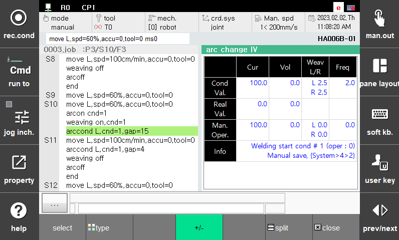

# 1.3.3.1 조작

자동모드에서 Arc 용접 중 [창조정] – [선택] – [아크IV변경]을 선택합니다.

<p align="center">
 </img>
 <em><p align="center">그림 1.10 Arc 용접 전류/전압 변경 대화상자</p></em>
</p>   

<br>

대화상자의 항목 별 내용은 다음과 같습니다. 

(1)	전류

 -  조건내용: 현재 사용중인 용접조건의 송급 속도를 나타냅니다.
 -  조정 값: 현재 제어기에서 용접기로 출력하고 있는 송급 속도를 표시합니다.
 -  실제 값: 디지털 용접기에서 제어기로 송신하고 있는 출력 용접 전류를 표시합니다.

(2)	실제 용접 전류

 -  조정 값: 디지털 용접기에서 제어기로 송신하고 있는 출력 용접 전류를 표시합니다.

(3)	용접전압 보정

 -  조건내용: 현재 사용중인 용접조건의 본 용접 전압 보정을 나타냅니다.
 -  조정 값: 현재 제어기에서 용접기로 출력하고 있는 용접 전압보정을 표시합니다.
 -  실제 값: 디지털 용접기에서 제어기로 송신하고 있는 출력 용접 전압보정을 표시합니다.


(4)	위빙 폭

 -  조건내용: 현재 사용중인 용접조건의 본 위빙 폭을 나타냅니다.
 -  조정 값: 사용자가 조작한 위빙폭을 표시합니다.


(5)	위빙 주파수

 -  조건내용: 현재 사용중인 용접조건의 본 위빙 주파수를 나타냅니다.
 -  조정 값: 사용자가 조작한 위빙주파수를 표시합니다.


 

\[주의\]  
- 전류/전압 변경은 용접시작조건에만 저장되며, 종료조건에는 저장되지 않습니다.

- ```arcon``` 명령어 형태 중 전류, 전압 값을 별도로 지정한 형태의 명령어인 경우 용접 조건에만 변경내용이 저장됩니다.

예시) ```arcon cnd=1,cur=200,vol=20``` <span style = "color:green"># 용접시작조건 1번에 변경된 전류, 전압이 저장</span>
