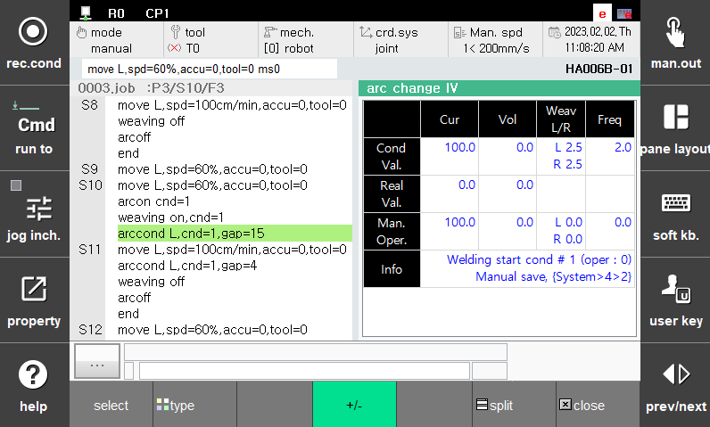

# 1.3.3 용접 중 전류/전압 변경 기능

Arc 용접작업을 티칭할 때 적절한 용접 전류/전압을 찾기 위해서 용접 수행 중 전류/전압을 변경해야 하는 경우 사용하는 기능입니다.

이 기능을 이용하면 용접 중 실시간으로 전류/전압을 변경하여 최적 조건을 찾고 확인된 조건을 바로 용접조건으로 저장하는 것이 가능합니다.

기능의 세부 내용 및 설정 방법은 다음과 같습니다. 여기서 %는 용접기의 최소와 최대값의 차이에 대한 단위 입니다.

(1)	Arc 용접 전류/전압 변경 대화상자 진입

 </img>
 <em>
그림 1.9 Arc용접 프로그램 및 전류전압 변경
</em>

 

- 자동모드에서 Arc 용접을 수행
- [창조정] – [선택] – [아크IV변경] 선택
- 대화상자 진입 완료
- 버튼 +/-를 클릭하여 조절버튼 창 진입

(2)	용접 중 전류/전압 조정단위 및 조정 키
    
- 버튼 +/-: 용접전류 1% 증/감
- [SHIFT] + 버튼 +/-: 용접전류 5% 증/감
- 버튼 +/-:: 용접전압 1% 증/감
- [SHIFT] + 버튼 +/-: 용접전압 5% 증/감

(3)	용접 속도 및 위빙 파라미터 조정 키
   
- WeavL버튼 +/-: 위빙 폭(좌) 0.1[mm] 증/감
- [SHIFT] + 버튼 +/-: 위빙 폭(좌) 0.5[mm] 증/감
- WeavR버튼 +/-: 위빙 폭(우) 0.1[mm] 증/감
- [SHIFT] + 버튼 +/-: 위빙 폭(우) 0.5[mm] 증/감
- Freq 버튼 +/-: 위빙 주파수 0.1[Hz] 증/감
- [SHIFT] + Freq 버튼 +/-:: 위빙 주파수 0.5[Hz] 증/감

(4)	전류/전압 변경 자동저장 설정 변경

- [시스템]』 → 『4: 응용 파라미터』 → 『2: 아크용접』대화상자 진입
- 14: Arc 용접 전류/전압 변경 자동저장 설정 유효, 무효 저장
- 무효: 저장안됨
- 유효: 사용자가 값을 변경하는 즉시 용접조건에 저장
