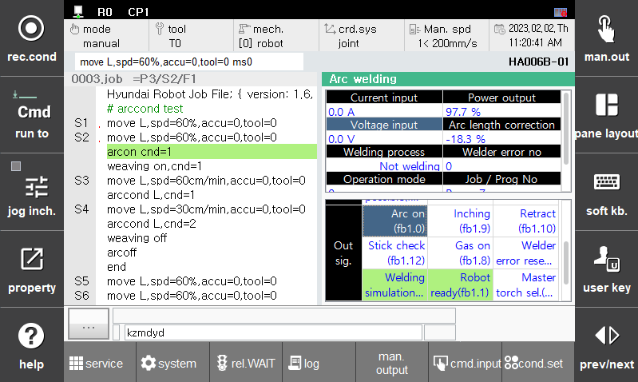

# 1.3.6 Arc 용접 신호 시험 기능

Arc 용접 신호 시험 기능은 용접에 필요한 주요한 신호의 입출력 상태를 테스트하고, 수동으로 용착 해제할 수 있는 기능입니다. 본 기능은 특정 신호의 동작 여부를 확인할 수 있기 때문에 용접기 및 통신의 이상 상태를 점검할 때 유용하게 사용할 수 있습니다.

본 기능을 사용하기 위해서는 티칭 펜던트 기본화면에서 [창조정]을 눌러 [선택]에서 [아크용접]을 선택합니다.
스크롤을 하단으로 움직여 output signal에 진입합니다. 원하는 출력신호를 man.output하여 신호를 on/off 테스트 할 수 있습니다.
'Input Signal'에서는 신호가 동작에 맞게 입력되고 있는지를 확인 할 수 있습니다.

또한 [용착해제]를 눌러 수동으로 용착해제를 명령할 수 있습니다.

 

 </img>
 <em>
그림 1.11 Arc 용접 모니터링
</em>

