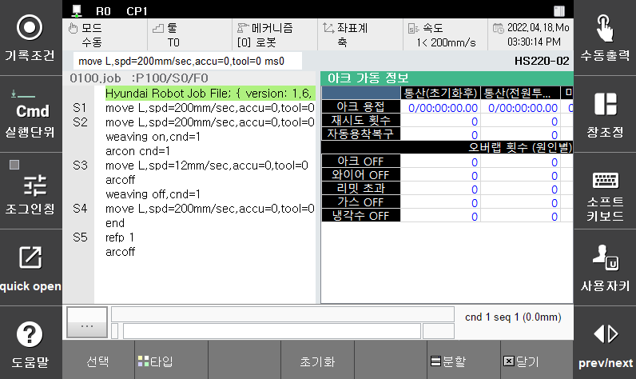

# 1.3.7 아크용접 가동정보

Arc 용접을 수행한 가동정보를 모니터링 창을 이용하여 확인하는 기능입니다. 이 기능을 이용하여 아래와 같은 사항을 쉽게 확인하고 관리할 수 있습니다.

(1)	누적된 용접시간과 최종 사이클에서 용접 시간을 확인할 수 있습니다.

(2)	용접 Tip 을 사용시간을 입력하면 사용시간을 지속적으로 모니터링 할 수 있습니다. Tip사용시간이 10% 이하로 남은 경우 경고를 출력합니다. 설정 된 사용시간을 초과하는 경우 다시 경고를 출력합니다.

(3)	용접 시작 시 자동으로 수행된 재시도 횟수와 자동으로 수행된 용착해제 횟수를 확인할 수 있습니다.

(4)	용접 중 로봇이 정지하는 경우 수행되는 오버랩의 횟수를 발생 원인 별로 확인할 수 있습니다.

 </img>
 <em>
그림 1.12 아크용접 가동정보 모니터링 창
</em>

  

 
조작 방법은 다음과 같습니다.

(1)	[pane layout]에서 [아크용접 가동정보]를 선택하여 아크용접 가동정보 모니터링 창을 실행할 수 있습니다. 또는, 분할된 모니터링 창에서 [창조정]버튼을 누른 후에도 선택할 수 있습니다.

(2) 해당 창에서 가동정보를 확인할 수 있습니다.