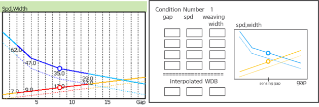

# 2.11 arccond

- 설명
    
    ```arccond``` 문은 아크용접의 전류, 전압, 속도, 위빙폭, 위빙 주파수를 설정하는 명령입니다. 또한 현재 ```arccond```의 조건으로부터 다음 ```arccond``` 조건까지 선형적으로 조건을 변경할 수도 있습니다. 즉, 좌방향거리/우방향거리 (gap) 에 따라 보간조건이 적용되며 Gap에 따른 용접속도와 위빙폭이 자동계산됩니다. 


- 문법
  
    - ```arccond``` <용접조건 변경방식 L, D>, spd=<용접속도>, rd=<우방향거리>, ld=<좌방향거리>, freq=<위빙주파수>, cur=<전류>, vol=<전압>
    - ```arccond``` <용접조건 변경방식 L, D>, cnd=<용접조건 데이터베이스 번호>

- 파라미터
  
   ① 용접조건 변경방식
     - 내용 : 연속 변경 L, 계단형 변경 D
     - 범위 : L, D
   
   ② cnd : 용접데이터베이스 조건번호
     - 내용 : 용접 구간에 사용할 용접조건 데이터베이스 번호를 설정합니다.
     - 범위 : 1~1000

   ③ gap
     - 내용 : gap 변수를 설정합니다. 이 변수의 값은 보통 터치센싱으로 측정한 gap [mm]이 들어갑니다.
     - 범위 : 사용자가 JOB에서 선언한 로컬변수 또는 전역변수

   ④ ld, rd : 좌방향거리/우방향거리
     - 내용 : 위빙 동작 시 좌/우 방향의 진폭을 설정합니다.
     - 범위 : 0.0~50.0 mm

   ⑤ freq : 위빙 주파수
     - 내용 : 위빙 주파수를 설정합니다.
     - 범위 : 0.0~10.0 Hz
      
   ⑥ cur : 전류
     - 내용 : 용접 구간의 용접 전류를 설정합니다.
     - 범위 : 1~1000 A(%, m/min)
   
   ⑦ vol : 전압
     - 내용 : 용접 구간의 용접 전압(보정)을 설정합니다.
     - 범위 : -200~200 V(%)

</br>  

- 사용 예
```python
   arccond L, spd=30, rd=4, ld=4, freq=3, cur=400, vol=28
   arccond L, cnd=1
```

- 보간조건편집창 

     아래와 같이 보간조건인 4개 점을 설정해 놓으면 설정한 좌우 위빙폭이 아닌 센싱한 gap에 따라 가변적으로 선형보간하여 위빙폭과 용접속도를 변경시킬 수 있습니다. 그림에서 circle은 현재 갭에 대해 점선으로 표시된 기준조건에 대해 보간된 용접속도 및 폭을 나타냅니다.

<p align="center">
 </img>
</p>

