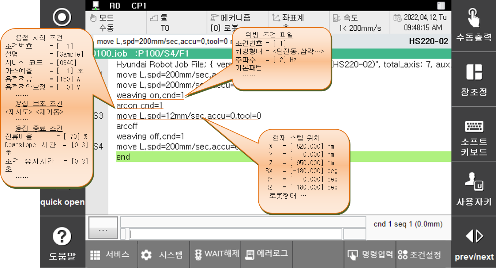

# 3.1 개요

Arc용접을 위한 작업 프로그램을 티칭할 때 전압, 전류 등 용접 관련 조건뿐만 아니라 위빙과 재시도/오버랩, 용접기의 특성 등 Arc 용접 기능의 세부적인 설정이 필요합니다. 또한 Arc 용접뿐만 아니라 로봇을 사용하는 일반적인 상황에서 티칭된 스텝이나 보조점의 위치의 정보(좌표 및 자세 등)를 확인해야 하는 경우도 있습니다. Arc 용접 관련 조건, 스텝 및 보조점의 위치 정보는 제어기 내부에서 파일의 형태로 관리하고 있어 편집이 쉽지 않기 때문에, 이러한 파일들을 쉽고 빠르게 편집할 수 있는 기능을 제공합니다.

Arc 용접 관련 조건들을 설정하거나 스텝과 보조점의 정보를 확인 및 편집을 번거로운 조작 없이 한 번의 키 조작으로 가능하게 하는 기능이 'quick open' 기능입니다.

용접시작조건의 편집을 예로 들면, Arc On 기능을 하는 ```arcon``` 명령문에 커서가 있을 때 [quick open] 키를 누르면 용접시작조건 중 현재 명령문에서 사용하는 조건번호의 내용이 표시됩니다. 이 화면에서 용접시작조건의 세부내용을 확인하거나 변경할 수 있으며 해당 조건 파일과 연관된 다른 조건파일이 있을 경우 바로 이동할 수 있습니다.

이처럼 본 기능은 특정한 명령문과 관련하여 조건파일이나 스텝 위치 등 세부 연관 내용을 쉽고 빠르게 확인 및 변경을 가능하게 하는 기능입니다.

 
<p align="center">
 </img>
 <em><p align="center">그림 3.1 로봇 프로그램에서 'quick open'</p></em>
</p>

특정 명령문에서 [quick open] 키를 누르면 관련된 파일이나 상세 내용을 화면에 표시합니다. 변경된 내용을 파일에 저장 후 종료를 원할 경우 <완료>를, 저장하지 않고 종료를 원할 경우 [취소]키를 누릅니다.
 
