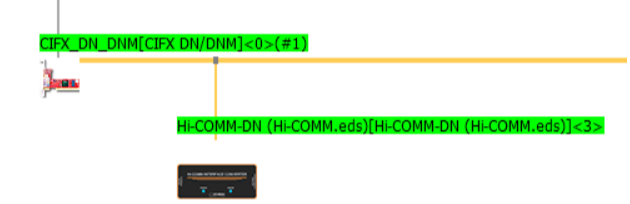

# 4.1 Arc 용접기 통신 연결

PC와 제어기를 이더넷 케이블로 연결하기 위해 아래 순서대로 진행합니다.

- PC에서 Sycon 프로그램을 실행합니다. 
- cifx카드를 추가하고 아이콘을 우측클릭하여 configuration을 클릭합니다.  
- Driver 항목 : netX Driver로 설정합니다.  
- Bus Parameters 항목 : Baud rate을 250kBits/s로 설정합니다.  
- Device Assignment 항목 : 추가된 CIFX카드를 클릭하고 OK를 클릭합니다.    
- cifx 아이콘을 우측클릭하여 download 합니다. cifx 아이콘을 우측클릭하여 네트워크 스캔을 누릅니다.

 </img>
 <em>
그림 4.0 Sycon 통신 상태
</em>

 
 
여기까지 진행할 경우 Sycon은 위와 같은 화면이 됩니다. (현대PNS용접기 연결시)
용접기에 해당하는 아이콘에서 우측클릭 후 disconnect 후 configuration에서 General항목에 있는 UCMM을 Group3으로 설정합니다.  용접기 아이콘을 우측클릭하여 upload한 후 cifx아이콘을 우측클릭하여 download를 합니다.

모든 과정이 끝났으면 로봇 티칭팬던트의 [설정]-[제어파라미터]-[입출력신호설정]-[fb블럭 할당] 메뉴에서 사용할 블록을 할당합니다. 여기까지 끝났다면 용접기로부터 제어기로 송신한 데이터들이 할당한 블록내에 표시될 것입니다. ([창조정]-[범용입력]-[fb할당한 번호/1.x 등..] 에서 확인)
