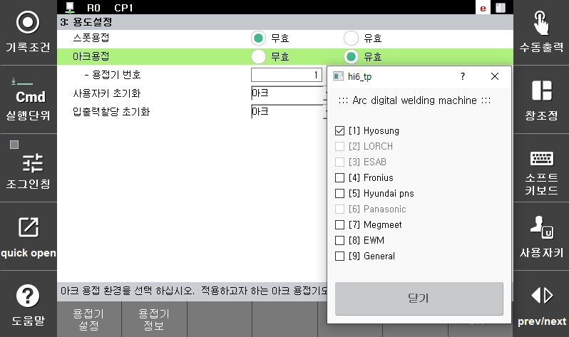
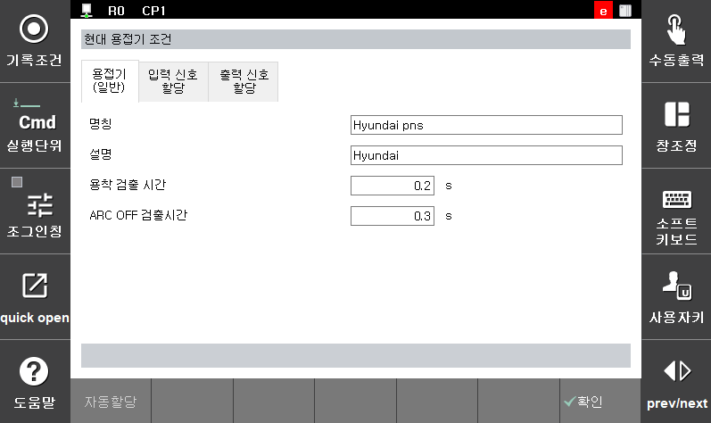
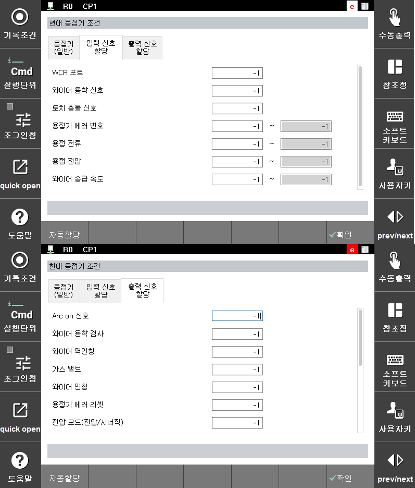

# 4.2 Arc 용접기 설정 

사용자는 당사 Arc 용접 로봇과 함께 다양한 용접기를 사용 가능합니다. 이를 위해 용접기 특성을 편집할 수 있는 기능을 제공합니다. 용접기 설정 화면은 다음과 같이 접근 가능합니다.

우선 사용하고자 하는 용접기는 『시스템』 → 『5: 초기화』 → 『3: 용도설정』 메뉴에서 ‘용접기 번호’항목으로 설정할 수 있습니다. 이 화면에서『용접기』를 선택하면 해당 용접기의 조건 편집화면이 나타납니다.

 </img>
 <em>
그림 4.1 용도설정 대화상자
</em>

 

 

 </img>
 <em>
그림 4.2 현대 용접기 조건 설정
</em>

   

 

 </img>
 <em>
그림 4.3 현대 용접기 입출력 신호 할당
</em>

   

용접기 조건 화면에서는 용접기와 관련된 특성에 대한 편집 기능을 제공하기 때문에 편집 가능한 항목은 용접기 별로 차이가 있습니다. 다음 항목들은 용접기 조건 화면에서 공통적으로 편집 가능한 항목들입니다.

 

공통적으로 편집 가능한 항목들의 내용은 다음과 같습니다.

(1)	번호  
    현재 설정하고 있는 용접기 번호를 나타냅니다. 해당 항목에서는 현재 선택된 용접기와 용접기 번호를 확인 가능하며 변경은 ‘용도설정’ 화면에서만 가능합니다.

(2)	명칭  
    용접기의 모델명을 기록합니다.
    기본적으로 당사가 지원하는 용접기의 모델명이 적혀있습니다.

(3)	설명  
    용접기에 대한 설명을 기록합니다. 기본적으로 용접기 메이커의 이름이 적혀있습니다.

(4)	용착 검출시간: [0.2]초 (범위: 0.1 ~ 10.0)  
    Arc 용접 종료 후 설정된 시간 동안 와이어 용착을 검사합니다.

(5)	ARC OFF 검출시간: [0.6] 초 (범위: 0.0 ~ 10.0)  
    Arc용접 중 Arc 꺼짐에 대한 기준 시간을 설정합니다. 해당 시간 이상 Arc가 꺼질 경우 Arc off로 인식합니다. 이 값이 작은 경우 Arc점화 실패가 자주 발생할 수 있습니다. 반면에 설정된 값이 너무 크면 Arc off 후에도 로봇 이동과 와이어 인칭이 계속 되는 시간이 증가하기 때문에 Arc off 후 로봇이 이동하는 거리와 와이어 돌출되는 길이가 증가합니다.
 
