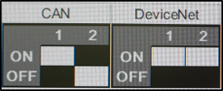

# 4.3 HRWI 특성 파일 편집

(1)	통신 방식  
효성 용접기와 통신하는 방식을 설정합니다. 효성 용접기는 기본적으로 CAN 통신을 지원하며 현장 상황에 따라 DeviceNet 통신을 사용할 수도 있습니다. 용접기에서 통신 설정은 용접기 덮개를 제거한 후 메인보드의 딥스위치를 통해 설정합니다.
다음은 Zi-sol 모델에서 통신 설정 방식입니다.  
    
- 용접기 전원 off 후 딥스위치 1번(SW1)의 설정을 변경 후 전원을 On 합니다.
- 아래 그램에서 밝은 색으로 표시되는 부분이 딥스위치의 돌출된 부분입니다.
 

 </img>

(2)	CAN 통신 속도: {125kbps, 250kbps, 500kbps, 1Mbps}  
용접기 통신할 통신 속도를 설정합니다. 사용하고자 하는 용접기가 지원하는 통신속도를 확인해야 합니다. 효성 용접기의 경우 250kbps의 통신 속도로 설정해야 합니다.

(3)	CAN 통신 포트: {CAN port 1, CAN port 2, CAN port 3}  
당사 제어기에서 지원하는 4개의 CAN 통신 포트 중 용접기와 통신을 위해 사용할 포트를 지정합니다. 4개의 CAN 통신 포트 중 1개는 기본적으로 사용 중이기 때문에 3개의 포트 중 1개를 선택해야 합니다.
  - CAN port 1: BD5B2나 제어기 문에 있는 DeviceNet 커넥터를 사용하는 경우
  - CAN port 2: BD574 DeviceNet 커넥터 사용 시
  - CAN port 3: BD574 2개 포트 모델 사용 시 작은 커넥터

(4)	입력설정 시작포트  
설정된 포트는 자동 할당 시 입력포트의 시작이 되는 기준 포트로 사용됩니다. 

(5)	출력설정 시작포트  
설정된 포트는 자동 할당 시 출력포트의 시작이 되는 기준 포트로 사용됩니다.

(6)	포트설정  
DeviceNet 인터페이스를 사용하는 경우 [포트설정]키를 누르면 입출력 신호 포트를 설정하기 위한 대화상자에 진입할 수 있습니다.

(7)	자동할당  
DeviceNet 인터페이스를 사용하는 경우 [자동할당]키를 누르면 위에서 설정한 입력설정 시작포트, 출력설정 시작포트를 기준으로 자동으로 입출력 신호가 할당됩니다. 이후 자동으로 포트 설정 대화상자에 진입할 수 있습니다.

(8)	포트 설정 대화상자  
포트설정이나 자동할당 버튼을 누르면 하기와 같은 입력포트 설정, 출력포트 설정 대화상자에 진입할 수 있습니다. 사용하지 않는 포트인 경우 0번으로 설정하면 해당 신호와 연관된 내부 프로세스를 건너뛸 수 있습니다. 각 포트는 기본적으로 설정된 값을 사용하는 것을 권장합니다.
  

 </img>
 <em>
그림 4.4 효성 용접기 사용 시 용접기 입력포트 설정 대화상자
</em>

  

 </img>
 <em>
그림 4.5 효성 용접기 사용 시 용접기 출력포트 설정 대화상자
</em>

  
