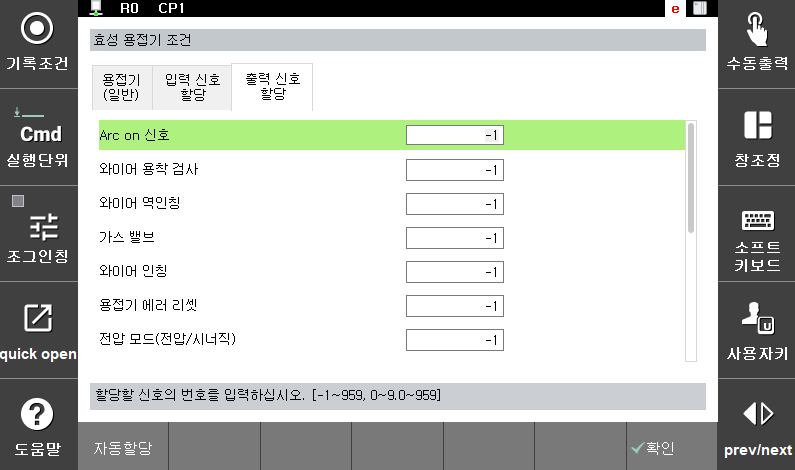

# 4.4 Fronius/EWM 용접기 특성 파일 편집

(1)	입력설정시작포트  
설정된 포트는 자동할당 시 입력포트의 시작이 되는 기준 포트로 사용됩니다.

(2)	출력설정시작포트  
설정된 포트는 자동할당 시 출력포트의 시작이 되는 기준 포트로 사용됩니다.

 

 </img>
 <em>
그림 4.6 Fronius 용접기 조건 설정
</em>

  

