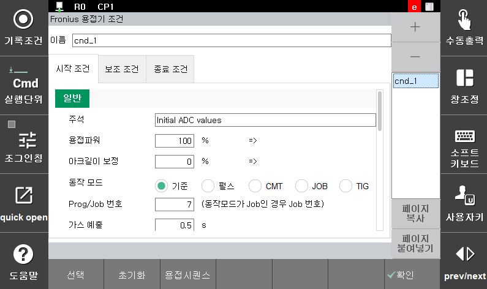
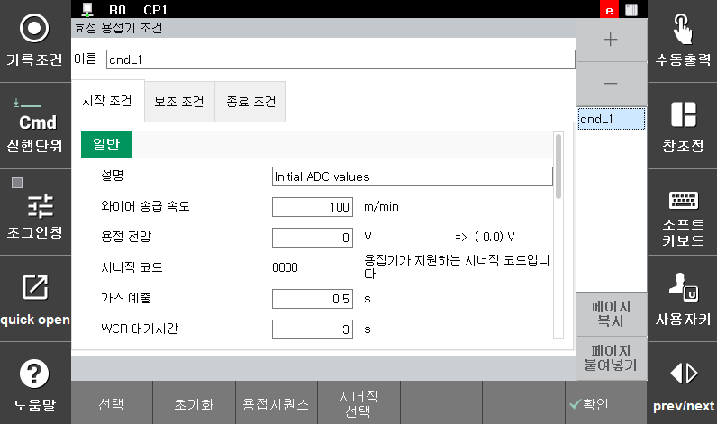

# 5.3 용접시작조건 - arcon cnd=X 에서 [quick open]으로 실행


Arc용접 설정이 디지털이고, ```arcon cnd=X``` 명령라인에 커서가 있을 때, [quick open]키를 누르면 다음과 같이 용접시작조건의 편집화면이 나타납니다.


 
<p align="center">
 </img>
 <em><p align="center">그림 5.2 Fronius 용접기 조건 설정</p></em>
</p>
  
 
<p align="center">
 </img>
 <em><p align="center">그림 5.3 효성 용접기 조건 설정</p></em>
</p>

 
 
<p align="center">
 </img>
 <em><p align="center">그림 5.4 EWM 용접기 조건 설정</p></em>
</p>

 


조건들을 편집 후 [ESC]키를 누르면 저장하지 않고 대화상자가 종료되며 [F7: 완료] 키를 누르면 설정 내용이 저장한 후 대화상자가 종료됩니다.

다음 설명되는 항목들은 용접기에 공통적으로 적용되는 항목들에 대한 설명입니다. 용접기별 전용 설정 가능 항목들은 [[4장 Arc 용접기 설정]](../../4_Setting/README.md)을 참조하시기 바랍니다. 

공통 항목의 내용들은 용접기마다 명칭, 단위, 범위에 차이가 있을 수 있습니다. 용접기별 차이점은 각 항목의 표를 참조하시기 바랍니다.

</br>

---

(1)	조건번호  
    편집할 용접시작조건 번호를 지정합니다. (32개의 조건을 지정하여 사용할 수 있습니다. ) 
<center>

| 항목 | 명칭 | 범위 |
| :---: | :---: | :---: |
| 모든 용접기 공통 | 조건번호 | 1 ~ 32 |

</center>
    
    

</br>

(2)	설명  
    해당 용접시작조건에 대한 설명을 기록합니다. 
<center>

| 지원 용접기 | 명칭 |
| :---: | :---: |
| 모든 용접기 공통 | 설명 |

</center>
    
(3)	시너직 코드  
    용접기에 전송할 synergic code를 설정합니다. 코드값의 설정은 별도의 synergic 선택 대화상자에서 이루어지게 됩니다. Synergic 선택 대화상자는 용접 시작 조건 화면에서 [도움말] 키를 누르거나 커서가 용접환경코드에 위치하였을 때 [ENTER]키를 눌러서 진입할 수 있습니다.
<center>

| 지원 용접기 | 명칭 | 단위 | 범위 | 기본값 |
| :---: | :---: | :---: |:---: | :---: |
| HRWI | 시너직 코드 | - |- | 040 |
| Fronius </br>(미지원) |||||
| EWM | JOB Nr.(synergic) | - |- | 185|

</center>
    
</br>

(4)	가스 예출(가스신호제어시)  
    Arc 용접 시작 전 용접부위를 대기와 격리시키기 위해 쉴드가스를 미리 배출하는 시간을 설정합니다.
<center>

| 지원 용접기 | 명칭 | 단위 | 범위 | 기본값 |
| :---: | :---: | :---: |:---: | :---: |
| 모든 용접기 공통 | 가스 예출 | 초 | 0.0 ~ 10.0 | 0.5 |

</center>

</br>

(5)	시너직 코드  
    용접 전류에 해당하는 값을 설정합니다. 본 조건 용접에서 사용되는 전류이며, 초기조건, 종료조건에서 사용되는 전류는 이 값의 비율로 결정됩니다. 
<center>

| 지원 용접기 | 명칭 | 단위 | 범위 | 기본값 |
| :---: | :---: | :---: |:---: | :---: |
| HRWI | 용접전류 | A |0.0 ~ 500.0 | 100 |
| Fronius | 용접파워 | % | 0.0 ~ 100.0 | 10 |
| ESAB/EWM | 와이어 송급속도 |  m/min | 0.0 ~ 25.0 | 3.1 |

</center>
    
</br>

(6)	용접전압보정/ Arc 길이보정  
    디지털 용접에서는 용접전압을 직접 입력하지 않고 synergic data에서 용접전류에 의해 선택된 용접전압을 사용하는 경우가 많습니다. Synergic data에 의해 자동적으로 선택된 용접전압의 변경을 원할 경우 해당 용접전압을 기준으로 하여 변경될 전압의 옵셋 값을 설정합니다. 
<center>

| 지원 용접기 | 명칭 | 단위 | 범위 | 기본값 |
| :---: | :---: | :---: |:---: | :---: |
| HRWI | 용접전압보정 | % | 50.0 ~ 150.0 | 100 |
| EWM | 용접전압보정 | V | -10.0 ~ 10.0 | 0 |
| Fronius | 아크길이보정 | % | -30.0 ~ 30.0 | 0 |
</center>
    
</br>

(7)	WCR 대기시간  
    WCR 입력을 대기하는 시간을 나타냅니다. 이 시간 내에 WCR신호가 들어오지 않으면 재시도를 수행합니다. 단, 재시도횟수가 0인 경우에는 에러를 출력하고 로봇이 정지하게 됩니다. 재시동방법 및 재시도횟수 등 재시도 관련 기능은 용접보조조건에서 설정 가능합니다. (5.5, 5.6 용접보조조건 참조)
<center>

| 지원 용접기 | 명칭 | 단위 | 범위 | 기본값 |
| :---: | :---: | :---: |:---: | :---: |
| 모든 용접기 공통 | WCR 대기시간 | 초 | 0.0 ~ 10.0 | 2 |


</center>
    
</br>

(8)	로봇지연시간  
    Arc용접이 정상적으로 시작된 후 로봇이 용접선을 따라 이동하면서 용접을 하기 전 이동을 대기하는 시간을 설정합니다. 초기조건과 무관하며 초기조건 처리 중에도 로봇이 이동할 수 있습니다.
<center>

| 지원 용접기 | 명칭 | 단위 | 범위 | 기본값 |
| :---: | :---: | :---: |:---: | :---: |
| 모든 용접기 공통 | 로봇지연시간 | 초 | 0.0 ~ 10.0 | 0 |


</center>
    
</br>

(9) 초기조건 유지시간  
    Arc용접 시작 시 초기 전류값을 유지하는 시간을 설정합니다.
<center>

| 지원 용접기 | 명칭 | 단위 | 범위 | 
| :---: | :---: | :---: |:---: |
| 모든 용접기 공통 | 초기조건유지시간 | 초 | 0.0 ~ 10.0 | 


</center>
    
</br>

(10) 초기 용접전류/용접파워/송급속도  
    Arc 용접 시작 시 초기조건 유지시간 동안 출력할 용접전류를 설정합니다. 본 조건 용접전류 대비 %로 설정합니다.
<center>

| 지원 용접기 | 명칭 | 단위 | 범위 | 기본값 |
| :---: | :---: | :---: |:---: | :---: |
| HRWI | 초기 용접전류 | % | 20 ~ 200 | 120 |
| Fronius | 초기 용접파워 | % | 20 ~ 200 | 120 |
| EWM | 초기 송급속도 | % | 20 ~ 200 | 120 |

</center>
    
</br>

(11) 초기 용접전압보정/ Arc 길이보정  
    Arc 용접 시작 시 초기조건 유지시간 동안 출력할 용접전압를 설정합니다. 시너직 전압 대비 보정값으로 설정합니다.
<center>

| 지원 용접기 | 명칭 | 단위 | 범위 | 기본값 |
| :---: | :---: | :---: |:---: | :---: |
| HRWI | 초기 용접전압보정 | % | 50.0 ~ 150.0 | 100 |
| EWM | 초기 용접전압보정 | V | -10.0 ~ 10.0 | 0 |
| Fronius | 초기 Arc 길이보정 | %| -30.0 ~ 30.0 | 0 |

</center>
    
</br>

(12) 슬로프 시간  
    초기조건과 본 조건 사이에 전류 변화를 슬로프로 처리하는 시간을 설정합니다.
<center>

| 지원 용접기 | 명칭 | 단위 | 범위 | 
| :---: | :---: | :---: |:---: |
| 모든 용접기 공통 | 슬로프 시간 | 초 | 0.0 ~ 10.0 | 


</center>
    
</br>

(13) 제한치 초과 허용 시간  
    용접 전류/전압, 피드모터 전류의 제한치 초과 허용시간을 설정합니다. 이 시간 이상 용접 전류/전압, 피드모터 전류가 제한치를 초과하는 경우 재시작을 수행합니다. 단, 재시작 횟수가 0인 경우에는 에러를 출력하고 로봇이 정지합니다. 재시작 방법 및 재시작 횟수 등 재시작 관련 기능은 용접보조조건에서 설정 가능합니다. ([5.6 용접 보조 조건 – 재기동] 참고) 이 시간이 0초로 설정되는 경우 Arc제한 감시기능을 사용하지 않습니다.
<center>

| 지원 용접기 | 명칭 | 단위 | 범위 | 기본값 | 
| :---: | :---: | :---: |:---: |:---: |
| 모든 용접기 공통 | 제한치 초과 허용 시간 | 초 | 0.0 ~ 10.0 | 0 | 


</center>
    
</br>

(14) 전압 상한치/전압 하한치  
    용접 중 전압의 상하한 제한치를 설정합니다. 제한치를 허용 시간 이상 넘을 경우 에러를 발생합니다.
<center>

| 지원 용접기 | 명칭 | 단위 | 범위 | 
| :---: | :---: | :---: |:---: |
| 모든 용접기 공통 | 전압 상한치/전압 하한치| V | 0.0 ~ 100.0 | 


</center>
    
</br>

(15) 전류 상한치/전류 하한치  
    용접 중 전류의 상하한 제한치를 설정합니다. 제한치를 허용 시간 이상 넘을 경우 에러를 발생합니다.
<center>

| 지원 용접기 | 명칭 | 단위 | 범위 | 
| :---: | :---: | :---: |:---: |
| 모든 용접기 공통 | 전류 상한치/전류 하한치| A | 0.0 ~ 1000 | 


</center>
    
</br>
    
</br>