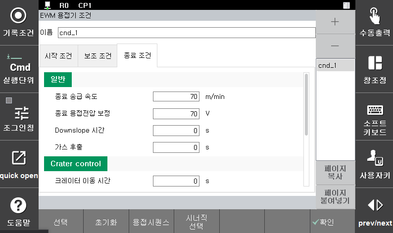

# 5.4 용접 종료 조건

Arc용접 설정이 디지털이고 용접시작조건 대화상자에서 [종료조건] 키를 누르면 다음과 같은 용접종료조건 편집화면이 나타납니다.

 </img>
 <em>
그림 5.5 용접종료조건 설정 (디지털 EWM 용접기 예)
</em>

 

용접 종료 조건의 항목을 수정 후 [ESC]키를 누르면 수정된 내용을 저장하지 않고 용접시작조건 대화상자로 이동합니다. [완료]키를 누르면 수정된 내용을 저장하고 용접시작조건 대화상자로 이동합니다.

 

---
각 항목별 내용은 다음과 같습니다.

 

(1)	조건번호: [1] (범위: 변경불가)  
    용접시작조건 번호를 표시합니다. 디지털 Arc용접기능에서는 종료조건번호와 시작조건번호는 하나로 관리됩니다. 따라서 종료조건번호를 변경하기 위해서는 시작조건번호를 변경해야 합니다. 종료조건화면에서는 확인만 가능하며 변경은 불가능합니다.

(2)	종료 용접전류/용접파워/송급속도  
    크레이터 처리시 출력할 전류의 값을 설정합니다. 본 조건(시작조건의 용접전류, 용접파워, 송급속도) 대비 % 량으로 설정합니다. 단, EWM 용접기의 경우 본 조건과 같은 m/min으로 설정합니다.

| 지원 용접기 | 명칭 | 단위 | 범위 | 기본값 |
| :---: | :---: | :---: |:---: | :---: |
| HRWI | 종료 용접전류 | % |10 ~ 100 | 70 |
| Fronius | 종료 용접파워 | % | 10 ~ 100 | 70 |
| EWM | 종료 송급속도 | m/min | 0.0 ~ 25.0 | 7.0 |

(3)	종료 용접전압보정/ Arc 길이보정  
    크레이터 처리 시 출력할 전압(Arc 길이) 보정값을 설정합니다. 전압은 출력할 전압을 지정하여 출력합니다.

| 지원 용접기 | 명칭 | 단위 | 범위 | 기본값 |
| :---: | :---: | :---: |:---: | :---: |
| HRWI | 종료 용접전압보정 | % | 50.0 ~ 150.0| 100 |
| EWM | 종료 용접전압보정 | V | -10.0 ~ 10.0 | 0 |
| Fronius | 종료 Arc 길이보정 |  % | -30.0 ~ 30.0 | 0 |

(4)	Downslope 시간(Crate Time): [0.10] 초 (범위: 0.0 ~ 10.0)  
    본 조건과 종료조건 사이에 전류 변화를 슬로프로 처리하는 시간을 설정합니다.  

 </img>
 <em>
그림 5.6 DownSlope 시간과 Crate 시간 차트
</em>

(5)	조건유지시간: [1] 초 (범위: 0.1 ~ 10.0)   
    용접종료조건의 ‘전류비율’ 항목에서 지정된 출력 값을 유지하는 시간을 설정합니다.

(6)	Burnback 조정: [  0] % (범위: -20 ~ 20)  
    Burnback 처리를 설정합니다.

(7)	가스 후출: [ 0.10] 초 (범위: 0.3 ~ 10.0)  
    Arc가 꺼진 후에도 보호가스를 계속 출력하는 시간을 설정합니다.

(8)	크레이터 후진거리: [  0] (범위: 0 ~ 100)  
    크레이터 처리 과정 중 DownSlope시간+조건유지시간 동안 로봇이 후진할 거리를 설정합니다. 속도는 거리와 시간에 의해 자동으로 결정됩니다.

(9) Retract 시간: [  0] (범위: 0.0 ~ 10.0)  
    용접 종료 처리가 끝난 후 로봇이 다음 이동을 수행하면서 와이어를 되감을 시간을 설정합니다. 간섭 등에 의해 와이어가 휘어지거나 다음 스텝 시작 시 와이어 접촉 상태로 용접이 시작되는 것을 방지하기 위한 경우 사용합니다.

(10) Retract 속도: [  0] (범위: 0 ~ 100)  
    용접 종료 시 와이어를 되감는 처리를 할 때 와이어 송급속도를 지정합니다. 용접기의 최대 전류에 대한 비율로 설정합니다.
