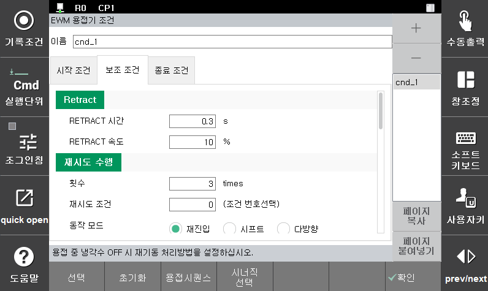
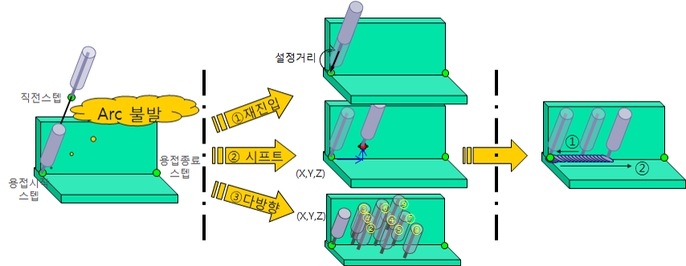

# 5.5.1 용접 보조 조건 - 재시도

Arc 용접을 시작할 때 모재의 용접 시작점 부근에 부착된 이물질 등의 원인으로 Arc 불꽃이 발생하지 못하는 경우가 있습니다. 재시도(Retry)기능은 이와 같은 Arc점화 실패 시 자동으로 Arc의 점화를 재시도 하여 로봇의 정지 없이 연속작업을 가능하게 하는 기능입니다.

Arc용접 설정이 디지털일 때 용접시작조건 대화상자에서 [보조조건] 키를 누르면 다음과 같은 용접 보조 조건 편집화면이 나타납니다.

  

 </img>
 <em>
그림 5.7 용접보조조건(재시도) 설정(EWM 용접기)
</em>

 
[참고 사항]   
재시도 기능은 Arc 점화 시도 후 점화에 실패했을 때 수행되는 기능이고, 재기동 기능은 Arc 용접 중 용접이 중단된 후 다시 재개될 때 수행되는 기능입니다. 


[그림 5.7]의 좌측 항목은 용접 보조조건 중 재시도 조건을 나타냅니다. 재시도 조건의 각 항목별 내용은 다음과 같습니다.

(1)	RETRACT시간: [0] 초 (범위: 0.00 ~ 10.00)  
    재시도는 와이어를 송출하여 용접을 시도한 후에 Arc가 발생 않았을 때 진행됩니다. 그렇기 때문에 재시도 할 때 와이어가 과도하게 송출된 상태일 수 있습니다. 이럴 경우 와이어가 모재와 접촉하여 용착이 발생하거나 모재와 너무 근접하여 Arc 발생이 불안정할 수 있습니다. 그렇기 때문에 재시도 전 와이어를 retract하여 용접에 적합한 환경을 만드는 기능을 지원합니다. 이 설정은 와이어를 retract할 시간을 지정하는 것입니다. 이 값이 0이 아닐 경우 와이어를 retract한 후 토치를 이동하고, 이후 Arc 발생을 시도 합니다. 

(2)	RETRACT속도: [10] % (범위: 0 ~ 100)  
    재시도 할 때에 와이어를 retract하는 속도입니다. 용접기에 따라 지원되지 않을 수 있습니다. (Ex. Saprom 용접기)

(3)	횟수: [5] 회 (범위: 0 ~ 9)  
    Arc점화 실패 후 재시도할 횟수를 지정합니다. 지정된 횟수 내에 Arc 점화를 성공하지 못하면 원점(처음 Arc점화 시도지점, 용접 시작점)으로 복귀 후 정지합니다.  

(4)	재시도조건: [0] (범위: 0 ~ 32)  
    Arc 점화를 재시도 할 때 사용할 용접조건의 번호를 입력합니다. 재시도 시 입력된 용접시작조건의 본 조건(전류, 전압 등)으로 용접을 수행하게 됩니다. 단, 입력된 조건번호가 “0” 인 경우와 동작모드가 재진입인 경우 현재 실행중인 용접시작조건의 본 조건으로 재시도 용접이 수행됩니다.

(5)	동작모드: <재진입, 시프트, 다방향>  
    재시도를 위해 토치를 이동시키는 방법을 설정합니다. 3가지 설정을 지원하며 설정에 따른 토치 이동 방법은 다음과 같습니다. [그림 5.10]을 참고하여 주십시오.
    
- A. 재진입  
    Arc발생 실패 시 직전 스텝으로 스텝 후진한 후 다시 Arc발생을 시도합니다. 그 이동거리는 용접보조조건 재시도 설정 메뉴에서 ‘후퇴/용접선 이동’거리로 설정합니다. 일정거리 스텝 후진 후 다시 스텝전진하기 때문에 전압/전류 조건은 용접시작 조건을 따릅니다.

- B. 시프트  
    용접보조조건의 재시도 조건에서 설정된 시프트 이동 량만큼 이동 후 Arc발생 스텝으로 복귀합니다. 시프트 거리는 용접선을 기준으로 전/후, 좌/우, 상/하 방향으로 설정할 수 있습니다. 재시도 시 용접 조건은 재시도조건 항목의 용접시작조건입니다. Arc발생이 성공하면 Arc를 유지하면서 설정된 속도로 용접 시작점으로 이동한 후 용접을 진행합니다.

- C. 다방향  
    용접보조조건의 재시도 조건 중 ‘시프트 이동량’에서 설정된 이동거리 중 전/후만큼 용접 선을 따라 이동 후 1차 시도를 합니다. 2차 시도는 좌/우, 상/하에서 설정된 거리까지 감안한 거리로 이동하여 수행합니다. 3차 시도는 2차 시도에서 좌/우 위치만 반대로 이동하여 용접을 시도합니다. 4~6차 시도는 1~3차 시도보다 2배 거리에서 같은 작업을 수행하며 7~9차 시도는 3배 거리에서 같은 작업을 시도합니다. 재시도 조건 항목의 용접시작조건으로 용접을 시작하며 Arc발생이 성공하면 Arc를 유지하면서 설정된 속도로 용접 시작점으로 이동한 후 용접을 진행합니다.

(6)	속도: [100]cm/분 (범위: 1 ~ 999)  
    재시도 할 때 토치가 재시도 위치로 이동하거나 용접시작점으로 복귀하는 속도입니다.

(7)	후퇴 이동 거리: [3] mm (범위: 0.00 ~ 99.99)   
    동작모드가 재진입으로 설정 시, 재시도 할 때에 토치를 이동시키는 거리입니다. 동작모드 설정은 시작조건에서 지정합니다. 

(8)	시프트 이동 량: 전/후=[2], 좌/우=[2], 상/하=[1] mm (범위: -99.9 ~ 99.9)  
    동작모드가 시프트, 다방향으로 설정된 경우, 토치가 이동하는 거리입니다. 
    

 </img>
 <em>
그림 5.8 재시도 기능 순서
</em>

