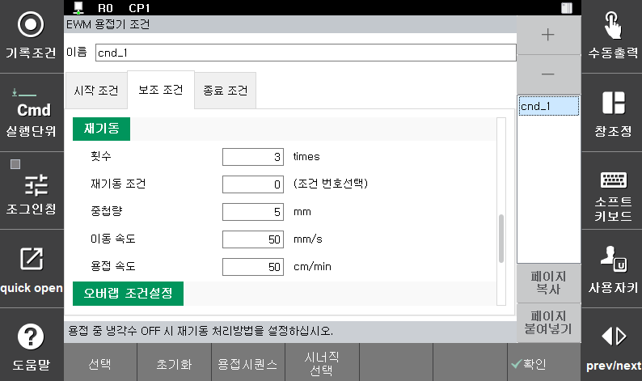
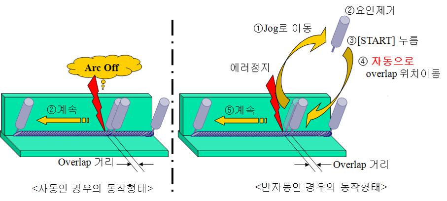

# 5.5.2 용접 보조 조건 - 재기동

Arc 용접 진행 중에는 Arc 꺼짐, 용접 전류 및 전압의 제한치 초과, 가스 압력 저하, 와이어 부족, 냉각수 에러 등으로 인해 용접이 중단될 수 있습니다. 이 때 용접이 정지된 지점에서 다시 용접을 시작하면 용접이 안된 부분이 발생할 수 있습니다. 재기동 기능은 이러한 경우 용접이 수행되지 않은 부분을 보완하기 위해 오버랩하여 용접을 수행하는 기능입니다.

재기동 조건설정에서는 Arc 꺼짐 등 특정 원인에 의해 용접이 중단된 후 재기동 할 때 재기동 방법 대해 설정합니다. 용접이 중단된 이후 별도의 조치 없이도 용접작업을 자동으로 재기동하거나 중단 원인을 제거한 후 다시 기동하면 일정 거리만큼 용접선을 따라 역방향으로 이동한 후 용접을 시작합니다. 결과적으로 에러가 발생하여 용접이 중단된 위치 근처에서는 용접 수행이 중복되는 오버랩 구간이 생기게 됩니다. 이를 통하여 용접 중단 후 재기동을 할 때 용접이 안된 부분이 생기는 것을 막을 수 있습니다.

 

 </img>
 <em>
그림 5.9 용접보조조건(재기동) 설정(EWM 용접기)
</em>

자동용착해제 조건은 용접 종료 후 와이어가 모재에 용착 되었을 때, 이를 자동으로 해제하는 기능에 대한 설정입니다.

자동 용착해제 조건의 각 항목별 내용은 다음과 같습니다.

(1)	RETRACT시간: [0] 초 (범위: 0.00 ~ 10.00)  
    용접 중에 용접이 중단되어 재기동을 할 때 다양한 이유로 와이어가 과도하게 송출된 상태일 수 있습니다. 이럴 경우 와이어가 모재와 접촉하여 용착이 발생하거나 모재와 너무 근접하여 Arc 발생이 불안정할 수 있습니다. 그렇기 때문에 재기동 전 와이어를 retract하여 용접에 적합한 환경을 만드는 기능을 지원합니다. 이 설정은 와이어를 retract할 시간을 지정하는 것입니다. 이 값이 0이 아닐 경우 와이어를 retract한 후 토치를 이동하고, 이후 Arc 발생을 시도 합니다.

(2)	RETRACT속도: [10] % (범위: 0 ~ 100)  
    재기동 할 때에 와이어를 retract하는 속도입니다. 용접기에 따라 지원되지 않을 수 있습니다. (Ex. Saprom 용접기)

(3)	재기동 횟수: [5] 회 (범위: 0 ~ 9)   
    동일용접 구간에서 재기동 처리의 최대 반복 횟수를 지정합니다. 이 횟수를 초과하면 “E1274 동일 용접구간 내 재기동 횟수 초과” 에러가 발생합니다.

(4)	재기동 조건: [0] (범위: 0 ~ 32)   
    재기동 할 때 오버랩 구간에서 사용할 용접조건의 번호를 입력합니다. 오버랩 하여 재기동 할 때 입력된 용접시작조건의 본 조건(전류, 전압 등)으로 오버랩 구간에서 용접을 수행하게 됩니다. 단, 입력된 조건번호가 “0” 인 경우 오버랩 구간에서부터 현재 실행중인 용접시작조건의 본 조건으로 용접이 수행됩니다.

(5)	중첩 량: [5] mm (범위: 0.0 ~ 99.9)  
    재 기동 할 때 용접을 중첩하는 길이(오버랩 거리)입니다. 중첩 길이만큼 되돌아 간 후 다시 용접을 시작합니다. 

(6)	이동속도: [ 50] mm/초 (범위: 1~999)  
    오버랩을 시작하는 위치로 토치를 이동 시키는 속도를 설정합니다. [그림 5.13]의 ③~④ 구간의 이동 속도를 의미합니다. (그림 5.10 참조)

(7)	용접속도: [ 50] cm/분 (범위: 1~999)  
    오버랩 시작 위치에서 종료 위치까지 중첩 용접을 할 때 로봇의 이동 속도를 설정합니다. [그림 5.10]의 ④에서 오버랩 거리만큼 용접하며 이동할 때의 속도입니다. (그림 5.10 참조)

용접시작점에서 용접종료점(⑤)으로 용접 진행 중 에러가 발생한 경우, 오버랩 조건이 반자동이면 사용자는 용접이 정지된 원인을 파악하고 에러를 처리합니다(①). 에러 요인 제거 후(②) [START]버튼을 눌러(③) 용접을 재개할 경우 로봇은 자동으로 오버랩 시작 위치로 [이동속도]에 설정된 속도로 이동합니다(④). 이동 후 오버랩 거리만큼 [용접속도]에 설정된 속도로 용접을 하며 그 이후에는 정상 속도로 용접을 하며 이동합니다. 단, 오버랩 구간 용접 중 에러가 발생한 경우는 다시 오버랩 하지 않고 그 지점에서 바로 용접을 시작합니다. 

(8)	오버랩 조건설정  
    [그림 5.11]의 우측 하단 항목은 Arc 용접 중 ArcOff(Arc꺼짐), Limit 초과, 가스Off(가스 압력 저하), 와이어Off(와이어 부족), 냉각수Off(냉각수 에러) 등의 원인으로 용접이 중단되었을 때 오버랩을 수행할 방법에 대해 설정합니다.  
    
-  A. 자동  
    자동으로 오버랩을 수행하는 설정입니다. 해당 설정은 Arc 꺼짐에 의해 용접이 중단된 경우에만 설정할 수 있습니다. 용접 중 Arc 꺼짐이 발생한 경우 정지하지 않고 용접보조조건의 재기동 항목에 설정된 방법으로 오버랩 용접을 수행한 후 본 작업을 진행합니다. 단, 오버랩 구간 용접 중 다시 Arc가 꺼지는 경우는 그 위치에서 바로 용접을 시작합니다.

- B. 반자동  
    사용자에 의해 오버랩을 수행하는 설정 입니다. Arc 꺼짐, 제한치 초과, 가스 압력 저하, 와이어 부족, 냉각수 에러가 발생할 경우 용접이 중단되고 로봇 본체도 정지합니다. 이후 원인 제거 후 사용자가 [기동]을 누르면 용접보조조건의 재기동 항목에 설정된 방법으로 오버랩 용접을 수행한 후 본 작업을 진행합니다. 이때 로봇을 조그동작을 통하여 다른 위치로 이동시킨 후 [기동]을 누르면 오버랩 용접위치로 바로 이동 후 용접을 수행합니다.


[**주의**]  
로봇 이동 시 스텝 전/후진키를 누르면 재기동 정보가 초기화되어 오버랩이 수행되지 않습니다. 반드시 조그 동작으로만 이동하십시오.


- C. 무시  
    에러를 무시하는 설정입니다. 해당 설정을 활성화하면 용접 중단 후 로봇이 정지하지 않고 계속 진행합니다. 즉 Arc가 꺼지거나 제한치를 초과해도 무시하고 계속 진행됩니다. 이 처리 방법은 Arc 꺼짐, 제한치 초과의 원인으로 용접이 중단 후 재기동하는 경우에만 가능합니다.

- D. 금지  
    오버랩을 금지하는 설정입니다. Arc 꺼짐, 제한치 초과, 가스 압력 저하, 와이어 부족, 냉각수 에러가 발생할 경우 용접이 중단되고 로봇 본체도 정지합니다. 이후 원인 제거 후 [기동]을 누르면 오버랩 동작을 하지 않고 로봇이 정지한 위치에서 용접을 시작하고 진행됩니다.

 

 </img>
 <em>
그림 5.10 재기동 동작 과정
</em>

 
