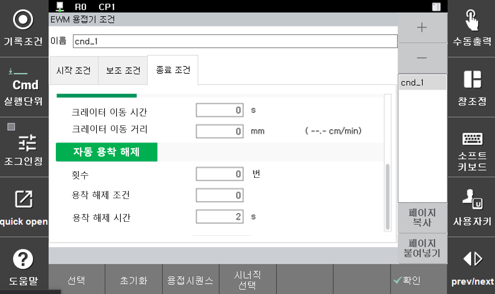

# 5.5.3 용접 보조 조건 –자동 용착해제

Arc 용접 종료 시 와이어가 모재에 용착되는 경우가 있습니다. 용접기에서는 이를 현상을 방지하기 위해 용접 종료 시 일시적으로 전압을 상승시키는 용착 방지 처리를 합니다. 용접기에서 이런 용착 방지 처리를 한 후에도 용착이 되는 경우가 있기 때문에 로봇 제어기에서도 용접 후 용착 검사 신호를 용접기로 전송하여 용착 여부를 확인합니다. 
자동 용착 해제 기능은 이렇게 용접 후에 용착이 검출될 때 자동으로 용착 해제를 수행하여 로봇이 정지하지 않고 연속적으로 작업할 수 있게 하는 기능입니다. 이 기능을 이용하면 용착 검출 시 즉시 일정 전압을 인가하는 용착 해제 처리가 자동으로 이루어집니다. 자동 용착 해제 시도는 설정된 횟수만큼 반복되며, 설정된 횟수를 초과할 때까지 용착이 해제되지 않는 경우 『용착 중』 신호를 출력하고 로봇은 정지하게 됩니다.

Arc용접 설정이 디지털이고 『[용접시작조건] → [용접종료조건]』대화상자에서 [보조조건]키를 누르면 다음과 같은 자동 용착해제 설정화면이 나타납니다. 

 

 </img>
 <em>
그림 5.11 자동 용착해제 설정
</em>

 

자동 용착해제 조건의 각 항목별 내용은 다음과 같습니다.

(1)	횟수: [2] 회 (범위: 0 ~ 9회)  
    용착해제 처리의 최대 반복 횟수입니다. 설정된 횟수 이내에 용착이 해제 되지 않을 경우에는 용착 에러(“E1262 와이어 스틱 검출 중”)가 발생합니다. 예외적으로 0으로 설정하면 용착 검사를 하지 않고 바로 다음 스텝으로 이동합니다.

(2)	용착해제조건: [0] (범위 : 0 ~ 32)  
    용착 해제 처리할 때 사용할 용접조건의 번호입니다. 입력된 조건번호가 “0” 인 경우 현재 실행중인 용접시작조건의 본 조건으로 용착 해제가 수행됩니다.

(3)	조건유지시간: [2] sec (범위 : 0.00 ~ 10.0)  
    용착 해제 조건의 출력을 유지하는 시간입니다. 너무 짧으면 용착 해제가 되지 않습니다.

