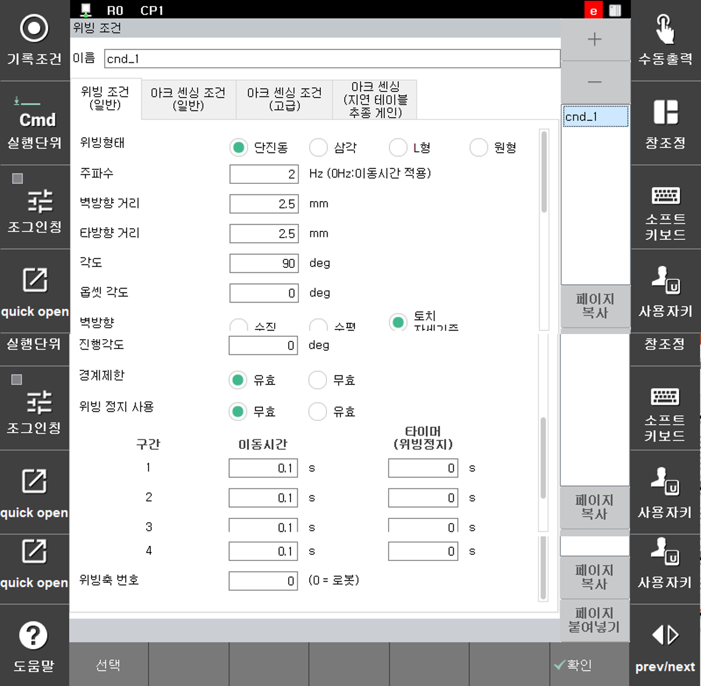

# 6.1.1 위빙 조건

```weaving ... ``` 명령어 위에 커서가 있을 때, [quick open]키를 누르면 다음과 같은 위빙 조건 편집화면이 나타납니다.

 
<p align="center">
 </img>
 <em><p align="center">그림 6.1 위빙조건 설정</p></em>
</p>


---

위빙 조건의 각 항목별 내용은 다음과 같습니다.

(1)	조건 번호: [1] (범위: 1~ 32)  
    위빙 동작의 설정이 저장된 조건 번호입니다. [+], [-] 버튼을 눌러 조건을 추가하거나 삭제할 수 있습니다. 현재 번호의 이전 또는 이후 조건 번호로 이동하여 해당 조건 번호를 편집 할 수 있습니다.

(2)	위빙 형태: <단진동, 삼각, L형, 원형>    
    위빙 동작의 형태를 지정합니다. ([[6.1.2 위빙 형태]](../1_Weaving_function/2_configuration_.md)  참조)

(3)	주파수: [2] Hz (범위: 0.0 ~ 10.0)  
    위빙 주파수를 설정합니다. 주파수의 범위는 0.0 ~ 10.0Hz 입니다. 주파수가 ‘0’으로 설정된 경우 이동시간을 적용합니다. ([[6.1.3 주파수]](../1_Weaving_function/3_frequency.md) 참조)  

(4)	기본패턴  
    위빙 동작의 패턴을 설정합니다. ([[6.1.4 기본 패턴]](../1_Weaving_function/4_pattern.md) 참조)  
- 벽방향 거리 : [2.5] (범위 : 1.0 ~ 25.0mm)  
- 타방향 거리 : [2.5] (범위 1.0 ~ 25.0mm)  
- 각도       : [90] (범위 : 0.1 ~ 180.0도)  
- 벽방향     : <수직방향, 수평방향, 토치자세기준>  
- 옵셋 각도: 토치 자세 기준 사용 시 토치 위치로부터 좌, 우로 기울어 지는 각도 지정

(5)	진행 각도: [0] (범위 : -90.0 ~ 90.0도)  
    진행 방향에 대한 위빙 각도 방향을 나타냅니다. 0도 인 경우 진행방향과 위빙방향은 직각을 이룹니다. ([[6.1.4 기본 패턴]](../1_Weaving_function/4_pattern.md) 참조)

(6)	경계 제한: <유효, 무효>  
    위빙궤적이 용접시작 및 끝 부분의 경계부분에 의해 제한되는지 여부를 설정합니다. 본 기능이 유효이면 위빙 궤적은 용접 구간 안에 제한됩니다. ([[6.1.4 기본 패턴]](../1_Weaving_function/4_pattern.md) 참조)

(7)	위빙 정지 시 로봇 동작: <이동, 정지>  
    위빙 패턴에서 타이머가 설정되는 경우 위빙의 좌우 끝 부분에서 위빙 동작이 정지됩니다. 이 경우 로봇의 동작은 계속 이동할 것인지 정지할 것인지를 설정합니다.

(8)	이동시간: [1] (범위: 0.01 ~ 10.0초), 타이머(위빙 정지): [  0] (범위 : 0.00 ~ 2.00)  
    위빙 주파수가 ‘0’으로 설정된 경우 이동시간으로 위빙을 수행합니다. 이때 각 구간별 이동시간과 구간 사이의 위빙정지시간을 설정합니다. (([[6.1.5 위빙 구간 설정]](../1_Weaving_function/5_weaving_section.md) 참고)
    ‘위빙 주파수’가 설정된 경우에는 ‘타이머(위빙 정지)’ 항목만 설정 가능합니다.
    설정된 주파수의 전체 시간에서 ‘타이머(위빙 정지)’에 설정된 시간을 제외한 시간 동안 로봇이 위빙 동작을 하며 위빙 정지 시간 동안은 위빙이 정지합니다. 위빙 정지 중 로봇의 이동 여부는 ‘위빙 정지 시 로봇 동작’ 설정이 적용됩니다. 

(9)	위빙 구동 축: <로봇, 부가축>, 부가축 번호: [1]  
    위빙 동작을 수행할 부분이 로봇인지 부가축인지를 설정합니다. 부가축으로 설정되는 경우 로봇은 기록된 대로 그대로 이동하며 부가축만 설정 거리와 주파수만큼 움직이며 위빙을 구현합니다. 부가축을 선택하는 경우 ‘부가축 번호’ 항목에 지정된 부가축이 동작하여 위빙을 수행합니다.
