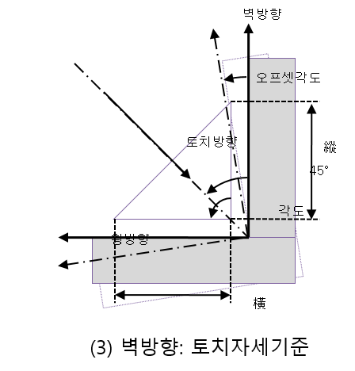
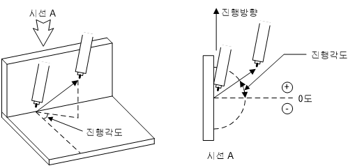

# 6.1.4 기본 패턴

다음 그림에서의 각 요소를 설정합니다. 
  

 </img>

 </img>
 <em>
그림 6.3 벽방향에 따른 위빙 요소
</em>

(1)	좌방향 거리
    좌(벽)방향(左각장)의 거리를 설정합니다.

(2)	우방향 거리
    우방향(右각장)의 거리를 설정합니다.

(3)	각도
    그림 6.3과 같이 좌(벽)방향과 우방향의 각도를 설정합니다. 각도는 좌(벽)방향에서부터 우방향까지로 나타냅니다. 단, REFP 4를 사용할 경우 이 각도는 무시됩니다.
    
(4)	벽방향 ([그림 6.3] 참고)
    좌(벽)방향을 수직(그림(1)), 수평(그림(2)), 토치자세기준(그림(3)) 중 어느 것으로 할 것인지 설정합니다. 일반적으로 좌(벽)방향은 수직방향으로 사용하며 수평방향은 평면상에서 각도가 180도인 위빙에 주로 사용합니다. 토치자세기준 위빙의 좌(벽)방향은 위빙 진행방향(그림 (3)의 진행방향은 나오는 방향, ⊙)을 기준으로 반시계방향으로 설정됩니다. 토치자세기준 위빙의 경우 모든 좌(벽)방향에 대한 대응이 가능하고 위빙 진행 중 좌(벽)방향이 바뀌는 경우에도 대응할 수 있습니다.

(5)	옵셋각도([그림 6.3] 참고)
    벽방향을 토치자세기준으로 설정한 경우 위빙면을 위빙 진행방향(그림 (3)의 진행방향은 나오는 방향, ⊙) 기준으로 회전하는 각도를 설정합니다. 0도 설정 시 좌(벽)방향과 우방향의 각도를 이등분합니다.

(6)	진행 각도
    용접선에 대한 위빙 진동 방향의 각도입니다. 설정 가능한 범위는 -90.0 ~ 90.0도입니다. 0도 설정 시 용접선과 직각으로 위빙이 동작합니다.

 </img>
 <em>
그림 6.4 위빙 진행 각도
</em>

    

(7)	경계제한
    진행각도가 0도가 아닌 위빙은 위빙 구간의 시작 밑 끝 부분에서 구간 경계를 넘어가는 경우가 발생할 수 있습니다. 경계제한 설정으로 구간 경계를 제한하여 구간 경계를 넘어가지 않게 위빙 동작을 수행할 것인지 제한 없이 위빙 동작을 수행할 것인지를 설정합니다.

 

 </img>
 <em>
그림 6.4.1 위빙 경계 제한
</em>

 
