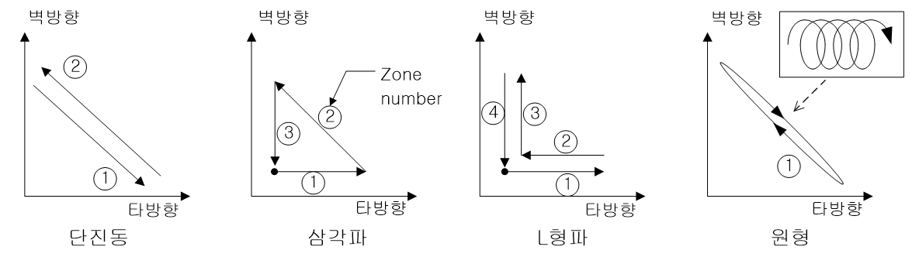

# 6.1.5 위빙 구간 설정

(1)	위빙 정지 시 로봇 동작

위빙 구간에 타이머(위빙 정지)가 0이 아닌 값이 설정되는 경우 해당 시간동안 위빙 구간 끝 부분에서 위빙 패턴이 정지합니다. 이 상태에서 로봇의 이동 여부를 설정합니다.

이동 설정 시 하기 그림의 좌측과 같은 동작을 수행하며 정지 설정 시 우측과 같은 동작을 수행합니다.
 

 </img>
 <em>
그림 6.4.2 위빙 정지시 로봇 동작
</em>

 

(2)	이동시간

「주파수」값을 ‘0’으로 지정했을 때 위빙 반복주기 설정에 사용되는 항목입니다. 다음 그림과 같이 구간별 이동시간을 개별적으로 지정합니다. 위빙에 사용되는 구간은 위빙의 형태에 따라 달라지게 됩니다. 따라서 설정된 위빙형태에서 사용되지 않는 구간(Ex. 단진동의 경우 3, 4번)에 설정된 이동시간은 무시됩니다.

 </img>
 <em>
그림 6.5 위빙 패턴별 이동구간
</em>

 

(3)	타이머

아래 그림과 같이 각 구간 끝점에서의 위빙 정지 시간을 설정합니다. 이 항목은 위빙의 주파수가 설정된 경우에도 적용됩니다.

위빙의 주파수가 설정된 경우 위빙 주기 중 로봇의 이동 시간은 다음과 같이 설정됩니다.

로봇 이동 시간 = (1 / 위빙 주파수) – 타이머 시간 총합


‘위빙 정지 시 로봇 동작’이 ‘이동’으로 설정되는 경우 이동 궤적이 정지하는 것이 아닙니다.  
아래 그림의 직선 형태가 됩니다.  

 
 

 </img>
 <em>
그림 6.6 타이머 지정 시 궤적 예시
</em>

 


‘위빙 정지 시 로봇 동작’이 ‘정지’로 설정되는 경우 이동 궤적까지 함께 정지합니다. 이 경우에도 로봇의 이동 속도는 동일합니다.
