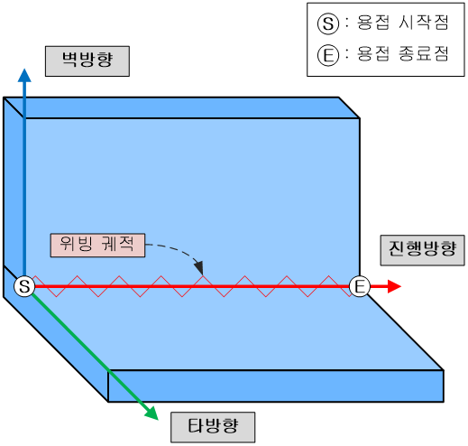
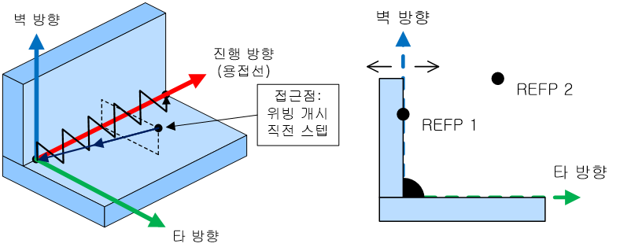
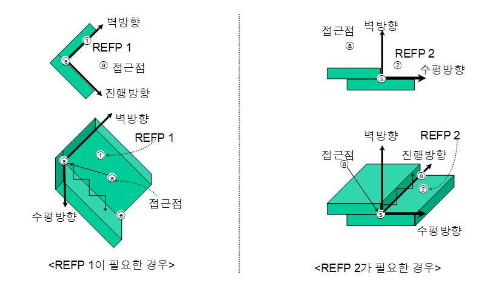
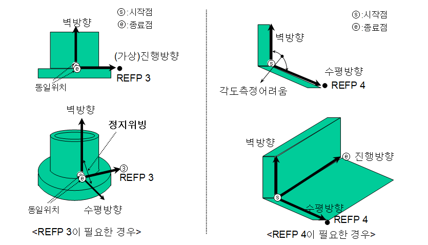

# 6.2.1 참조점 종류

 
<p align="center">
 </img>
 <em><p align="center">그림 6.7 위빙 좌표계</p></em>
</p> 


(1)	refp 1 (참조점 1)  
    ```refp 1```은 위빙 좌표계의 벽방향을 지정하는 명령어입니다. 특별히 벽방향을 지정하지 않는 경우 로봇은 수직방향을 벽방향으로 하여 위빙 동작을 실행합니다. 따라서 벽방향이 수직이 아닌 경우 이 명령을 통하여 벽방향을 지정해야 합니다. 
    사용 방법: 작업물의 벽방향 면 위의 한 점을 refp 1로 기록합니다. 이 점과 용접선(직선ⓢⓔ)으로 벽방향 면을 결정할 수 있습니다. refp 1 명령만 사용하는 경우 타방향은 설정된 벽방향을 진행방향 기준으로 기본패턴 각도만큼 회전한 방향으로 설정됩니다.

(2)	refp 2 (참조점 2)  
    ```refp 2```는 벽방향을 결정하는 평면(벽방향을 포함하는 평면)을 기준으로 하여 해당 평면의 양쪽 공간 중 어느 쪽에 위빙궤적을 생성할 것인지를 설정하는 명령어입니다. 
    사용방법: 위빙을 수행할 면 쪽의 공간 상 임의의 점을 refp 2로 기록합니다. [그림 6.8]은 두 모재 사이의 공간 상에 참조점 2를 기록했을 때 설정되는 위빙 좌표계의 예시입니다. refp 2 명령만 사용하는 경우 로봇 좌표계의 Z축을 벽방향으로 하여 타방향이 설정됩니다.  

(3)	refp 3 (참조점 3)  
    ```refp 3```은 로봇은 정지하고 포지셔너만 회전하는 정지위빙에서 위빙의 진행방향을 지정하는 명령어입니다.
    사용방법: 로봇이 정지하고 있는 위치에서 진행방향을 나타내는 직선 상의 임의의 점을 REFP 3으로 기록합니다. 로봇은 용접 시작점과 refp 3로 이루어진 선의 수직방향으로 위빙을 합니다.
    사용 예: refp 3 교시 후 용접 시작 스텝과 종료 스텝의 위치를 동일하게 교시. 이동속도는 시간으로 지정. (주의: 이 때 REFP 3이 지정되어 있지 않은 경우 위빙을 하지 않고 에러가 발생합니다.)  

(4)	refp 4 (참조점 4)  
    ```refp 4```는 벽방향과 타방향의 각도를 설정하는 명령어 입니다. [그림 6.8]은 90도로 설정했을 때의 예시입니다. 이 명령어를 이용하여 각도를 지정하는 경우 [기본 패턴]  [각도]에서 설정한 값은 무시됩니다.

    
<p align="center">
 </img>
 <em><p align="center">그림 6.8 위빙 방향과 참조점</p></em>
</p> 
    

 <p align="center">
 </img>
 </img>
 <em><p align="center">그림 6.9 참조점 종류별 활용</p></em>
</p>   

    


    

- refp 1: 용접선과의 거리는 최소 5mm 이상으로 설정하십시오.  
- refp 2: 벽 방향 평면과의 거리는 최소 5mm 이상으로 설정하십시오.  
- refp 3: 시작점과의 거리가 최소 5mm 이상이 되도록 설정하십시오.  
- refp 4: 위빙 패턴의 각도를 측정하기 어려운 경우 각도를 지정합니다.
