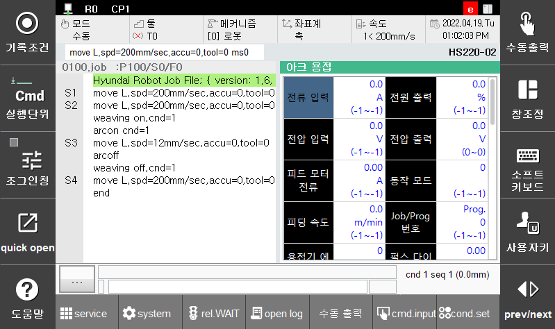

# 7.1.1 세부 정보 모니터링

본 기능은 Arc 용접과 관련된 세부 데이터를 확인할 수 있는 기능입니다. 설정된 용접기에 따라 제공하는 정보가 다르기 때문에 해당 모니터링 창은 설정된 용접기에 따라 다를 수 있습니다. 용접기와 통신 오류가 발생하거나 통신 연결이 되어 있지 않은 경우 ‘용접기 에러코드’나 ‘용접기 통신상태’ 항목이 붉은색 배경으로 표시됩니다. 세부정보 모니터링으로 다음과 같은 데이터를 확인할 수 있습니다.

 </img>
 <em>
그림 7.1 Arc용접 세부 정보 모니터링
</em>

(1)	현재 용접기에서 출력되고 있는 실제 용접 전류(A)

(2)	용접 전류 제한 치, Arc제한 감시기능을 사용하지 않는 경우 ‘---’로 표시

(3)	로봇에서 용접기로 출력하는 지령 용접 전류(A)

(4)	1초 동안 Arc단락횟수

(5)	현재 용접기에서 출력되고 있는 실제 용접 전압(V)

(6)	용접 전압 제한 치, Arc제한 감시기능을 사용하지 않는 경우 ‘--.- ‘로 표시

(7)	로봇에서 용접기로 출력하는 지령 용접 전압 옵셋값(V)

(8)	옵셋값+시너직 전압 즉, 목표 출력 전압(V)

(9)	실제 피딩모터를 구동하는 전류값(A)

(10) 피딩모터 Arc제한 감시기능을 사용하지 않는 경우 ‘--.-‘로 표시(A)

(11) 피딩모터 회전속도(rpm)

(12) T: 명령송신횟수, R: 명령수신횟수

(13) R: 재시도횟수, B: Busy검출횟수, N: NG횟수, E: 에러횟수

(14) 용접기 에러코드

(15) 용접기로 전달된 시너직 코드

(16) 용접진행단계
