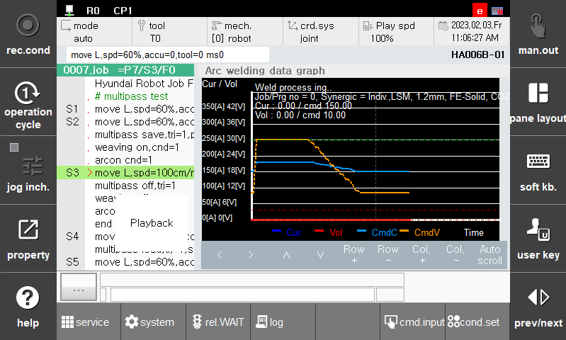

# 7.1.2 용접파형 모니터링

용접파형 모니터링은 용접 데이터의 파형과 관련된 정보를 표시하여 용접 데이터의 순간적인 정보뿐만 아니라 과거 정보도 한 눈에 알아볼 수 있게 합니다. 

 

 </img>
 <em>
그림 7.3 Arc용접 파형 모니터링
</em>

모니터링 창에서 확인할 수 있는 내용은 다음과 같습니다.  

- (1)	용접 상태 (초기조건, 가스선출, 종료조건, 가스후출, 크레이터이동, 본용접 등..)  
- (2)	Job/Prog no, Synergic 설정내용  
- (3)	입력 전류 / 지령전류 그래프  
- (4)	입력 전압 / 지령전압 그래프  
- (5)	입력전류, 전압의 이동평균 필터링된 그래프  
- (6)	용접 전류전압의 상/하한 값  
  
용접파형 모니터링은 좌/우, 상/하 이동 기능을 제공합니다. 또한 행과 열을 추가하여 볼 수 있습니다. Auto scroll을 토글시키면 용접도중에도 지난 용접 화면을 살펴볼 수 있습니다. 

