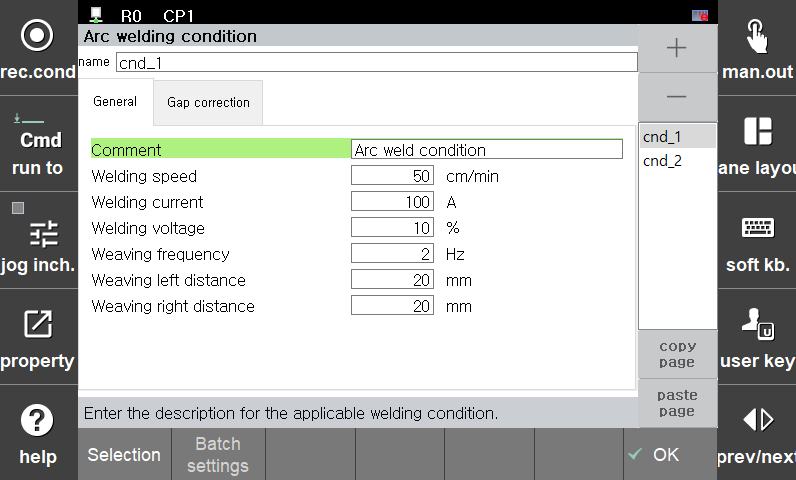

# 8.1.2 WDB(용접데이터베이스)를 이용한 계단형 변경
arccond D, cnd=1의 명령어에서 속성창에 진입하면 다음과 같은 설정항목을 볼 수 있습니다.
 
<p align="center">
 </img>
 <em><p align="center">그림 8.1 용접조건 대화상자</p></em>
</p> 

<br>

cnd(용접조건)를 추가하거나 삭제하여 다음과 같은 용접조건을 DB화 하여 사용할 수 있습니다.
DB화 가능한 조건 : 용접속도, 전류, 전압, 위빙주파수, 위빙폭

이를 이용하여 다음과 같은 JOB을 구성할 수 있습니다.

```python
move L, spd=60%, …
move L, spd=10%, …	    #용접점 진입 스텝
arcon cnd=1
move L, spd=40cm/min, …
arccond D, cnd=1  	    #용접 DB 1번 조건으로 즉시 변경
move L, spd=30cm/min, …
arcof
end
```