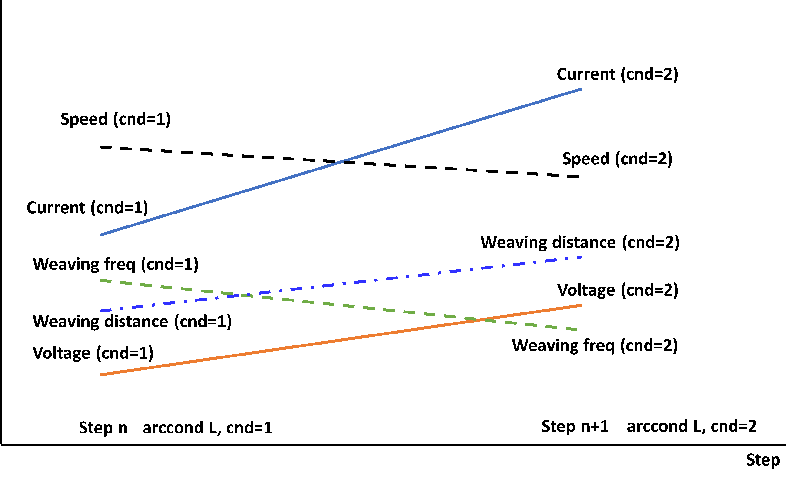

# 8.1.3 WDB(용접데이터베이스)를 이용한 연속형 보간 변경


예를들면, 해당기능은 용접 시작위치에서 Butt gap이 5mm이고 용접 종료위치에서 Butt gap이 25mm인 작업물을 용접할 때, 용접을 하면서 전류, 전압, 용접속도, 위빙폭, 위빙주파수 등을 선형적으로 보간하며 용접이 가능합니다. 이때, 용접조건의 연속변경(L, 보간)은 다음과 같이 직선형태로 이루어집니다.
 
<p align="center">
 </img>
 <em><p align="center">그림 8.2 용접조건의 직선보간</p></em>
</p> 

<br>

DB 1번의 위의 항목들과 DB2의 위의 항목들을 이용하여 연속형 보간변경을 사용하는 JOB은 다음과 같습니다.

```python
move L, spd=60%, …
move L, spd=10%, …	    #용접점 진입 스텝
arcon cnd=1
move L, spd=40cm/min, …
arccond L, cnd=1  	    #용접 DB 1번 -> 2번 조건으로 연속보간 변경
move L, spd=30cm/min, …    #이 스텝에서 연속적으로 cnd=1에서 cnd=2의 값으로 조건이 선형변경된다.
arccond L, cnd=2  	    #다음 스텝에선 arcof가 있어야 한다.
arcof
move L, spd=10%, …	    #용접점 탈출 스텝
end
```