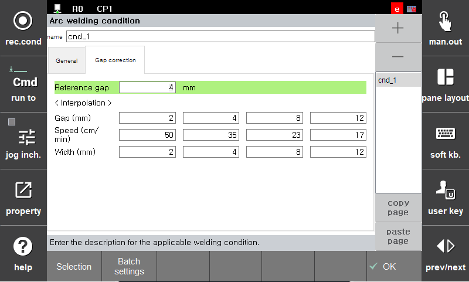
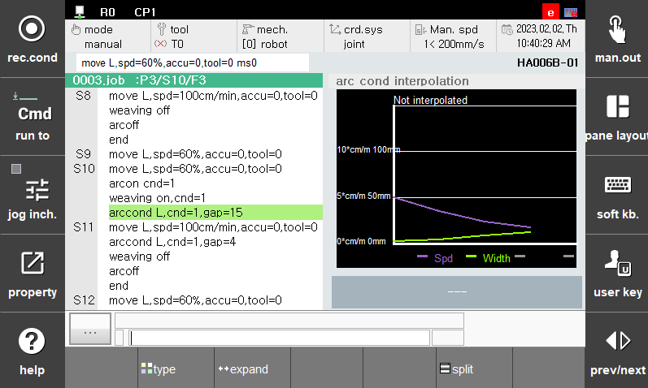
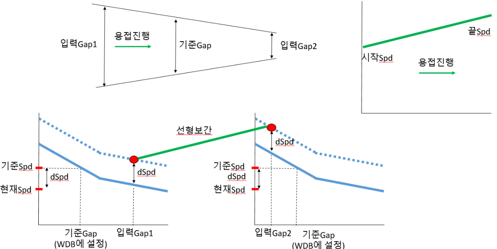

# 8.1.4 보간조건을 이용한 용접속도 및 위빙폭 변경 기능

이 기능은 위의 기능들과 별개인 기능입니다. 기준 gap에 따라 용접조건을 설정해 놓고, 실제 터치센싱으로 용접시점과 끝점의 gap을 계산하여 용접속도와 위빙폭을 자동으로 계산해주는 기능입니다.
```arccond``` 명령어의 속성창에서 “Gap correction” 항목 탭에 진입하면 조건별로 Gap에 따른 속도와 폭을 설정할 수 있습니다. 창분할에서 “아크보간”을 클릭하면 여기서 설정한 것을 그래프로 볼 수 있습니다.

<p align="center">
 </img>
 <em><p align="center">그림 8.3 용접 조건(갭 보간) 대화상자</p></em>
</p> 

<p align="center">
 </img>
 <em><p align="center">그림 8.4 아크보간 모니터링</p></em>
</p> 


<br>
이 기능의 동작은 다음과 같습니다.

 <p align="center">
 </img>
 <em><p align="center">그림 8.5 용접 조건의 보간 동작</p></em>
</p> 

<br>
 

용접 속도를 예를 들어 보면 다음과 같습니다.
Gap correction에 입력된 기준 gap을 기반으로 용접속도와 기준값이 됩니다.
용접 시점에서는 현재 용접속도와 기준 gap에서의 기준속도의 차이만큼 용접 시점의 f(gap_start)의 위쪽으로 더하여져 시작점에서의 용접속도가 결정됩니다.
마찬가지로, 용접 끝점에서 현재 용접속도와 기준 gap에서의 속도의 차이만큼 f(gap_end)의 위쪽으로 더하여져 끝점에서의 용접속도가 결정됩니다.
위 그림과 같이 최종적으로 2개의 arccond 명령어 사이의 스텝에서 선형적으로 용접속도가 증가합니다.

JOB 구성예시는 다음과 같습니다.


```python
move L, spd=60%, …
move L, spd=10%, …	    #용접점 진입 스텝
arcon cnd=1
move L, spd=40cm/min, …
arccond L, cnd=1, gap=20  
move L, spd=30cm/min, …    #이 스텝에서 연속적으로 용접속도와 위빙폭이 선형변경된다.
arccond L, cnd=2, gap=10   
arcof
move L, spd=10%, …	    #용접점 탈출 스텝
end
```