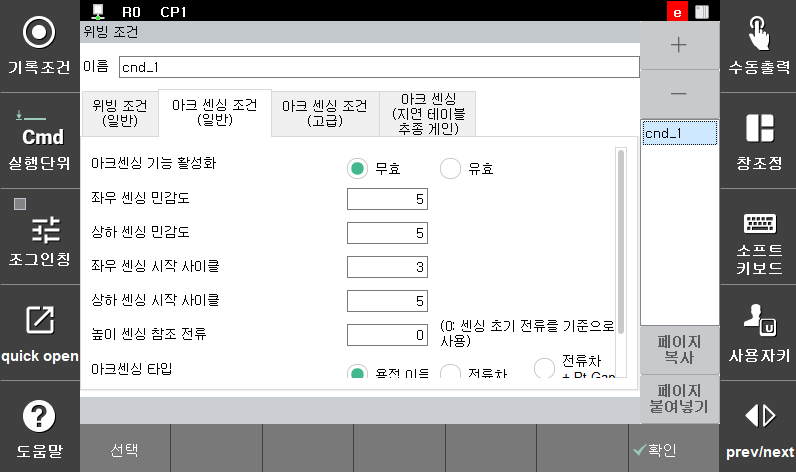
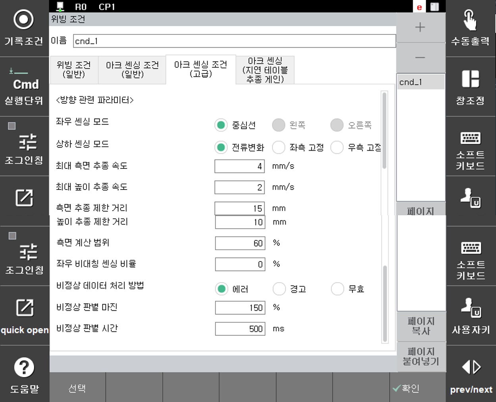
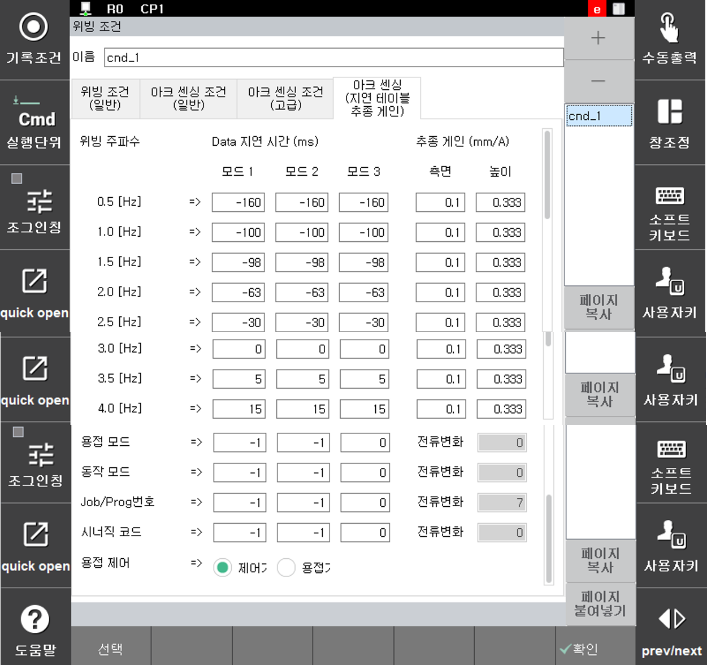

# 8.3.1 아크센싱 조건

위빙 파일 조건편집화면에서 두 번째 화면에는 아래와 같은 아크센싱 조건이 나타납니다. 이는 위빙 중에 사용이 가능한 아크센싱에 관한 설정을 하는 부분입니다. 

 </img>
 <em>
그림 8.14 아크센싱 조건-일반 대화상자
</em>

각 항목별 설정 및 조작방법은 다음과 같습니다.

(1) 아크센싱 기능 활성화: <무효, 유효>  
    아크센싱 기능의 사용 여부를 설정합니다.

(2) 좌우 센싱 민감도: [0 ~ 10]  
    위빙 면에서 좌우 방향 센싱 민감도를 설정합니다.

(3) 상하 센싱 민감도: [0 ~ 10]  
    위빙 면에서 상하 방향 센싱 민감도를 설정합니다.

(4) 좌우 센싱 시작 사이클: [0 ~ 9]  
    위빙 면에서 좌우로 센싱을 시작할 사이클을 설정합니다.

(5) 상하 센싱 시작 사이클: [좌우 시작 사이클+1 ~ 10]  
    위빙 면에서 상하로 센싱을 시작할 사이클을 설정합니다.

(6) 상하 센싱 기준 전류: [0 ~ 3000]  
    상하방향 센싱을 수행할 때 기준이 되는 전류를 설정합니다. 이 설정에 의해 토치 높이가 조정됩니다. 0으로 설정하는 경우 초기 구간 전류의 평균값이 기준이 됩니다. 0으로 설정하는 경우 용접 시작 부위에 가접이 있는 경우 부정확하게 높은 초기 전류가 기준이 되어 토치 충돌이 발생할 수 있습니다.

(7) 아크센싱 타입 선택: <용접선, 전류차, 전류차+Gap>  
    용접선 추종 방식을 선택합니다. 용접선은 정확한 직각 필렛 용접이면서 비대칭 센싱을 사용하는 경우 선택합니다. 일반적인 대칭 아크센싱에서는 전류차 방식을 사용합니다. 전류차+Gap 방식은 센싱 중간에 폭을 자동으로 조정해야 하는 경우 선택합니다.

(8) 실시간 Gap 센싱 민감도: [0 ~ 10]  
    전류차+Gap 방식을 사용할 때 폭의 변동 민감도를 설정합니다. 이 값은 비드 품질 및 폭 변화 정도에 따라 적합한 값을 설정합니다.

 

---
아크센싱 조건-사용자 대화상자에서 아래와 같은 아크센싱 조건-엔지니어 대화상자가 나타납니다. 이 대화상자는 엔지니어만 편집할 수 있습니다.

 </img>
 <em>
그림 8.15 아크센싱 조건-고급 대화상자
</em>

각 항목별 설정 및 조작방법은 다음과 같습니다.

(1) 상하 센싱 모드: <전류변화, 벽방향(CCW)고정, 타방향(CW)고정, 무효>  
    상하센싱을 수행하는 방법을 설정합니다.
-	전류변화: 센싱 초반 기준데이터 평균값을 기준으로 높이센싱을 수행
-	벽방향(CCW)고정, 타방향(CW)고정: 토치가 전진하는 방향으로 봤을 때 한 면이 고정되고 그 반대쪽 면에서만 변형이 발생하는 경우 좌우 보정량과 고정면의 관계에 따른 이동량으로 높이센싱을 수행
-	무효: 상하센싱이 필요하지 않거나 수행할 수 없는 평면 아크센싱인 경우 좌우센싱만 수행할 때 선택

(2) 초당 최대 보정거리(좌우/상하): [0.1 ~ 20.0] mm  
    1초동안 최대로 추종할 수 있는 거리를 설정합니다. 사용자 대화상자에서 10을 설정하는 경우 여기서 설정한 최대 보정거리로 추종을 수행하게 됩니다.

(3) 좌우/상하 궤적 이탈 제한: [0 ~ 200]  
    좌우/상하 방향 아크센싱 추종거리 제한치를 설정합니다. 아크센싱에 의해서 설정된 제한 거리 이상으로 추종이 발생하는 경우 에러로 정지합니다.

(4) 좌우 비대칭 센싱 비율: [-40 ~ 40] %  
    비드의 좌우폭이 다를 때 이를 감안하여 센싱하기 위한 비대칭 센싱 비율을 설정합니다.

(5) 비정상 데이터 처리방법: <에러, 경고, 무효>  
    센싱 동작 중 ‘비정상 판별 마진’으로 계산된 정상 전류의 범위를 ‘비정상 판별 시간’이상 초과한 경우 처리하는 방법입니다.  
- 에러: 로봇은 에러를 표시하고 정지합니다.
- 경고: 로봇은 경고를 표시하고 계속 작업을 진행합니다.
- 무효: 로봇은 그대로 작업을 계속 진행합니다.

(6) 비정상 판별 마진: [100 ~ 200] %  
    이전 5개의 데이터를 이용해서 비정상을 판단할 범위를 설정합니다.

(7) 비정상 판별 시간: [10 ~ 1000] ms  
    비정상 판별 마진을 벗어난 전류 입력을 허용할 시간을 설정합니다. 이 시간을 초과하여 마진을 벗어나는 경우 처리방법에 따라 로봇이 동작합니다.

(8) 궤적 이탈 감소: <무효, 유효>  
    센싱용 데이터가 비정상인 경우 해당 카운트의 보정량을 무시할 것인지 설정합니다. 이 옵션이 ‘유효’인 경우 데이터의 노이즈가 심하면 이전 보정량을 그대로 유지합니다.

(9) 스텝 전후진 시 보정거리 유지: <클리어, 유지>  
    아크센싱, 멀티패스 동작 구간에서 로봇을 스텝 전후진 시키는 경우 보정량을 유지할 것인지를 설정합니다. 클리어로 설정하는 경우 로봇 스텝 후진 시 아크센싱 보정량이 클리어 됩니다.

 

---

아크센싱 조건-엔지니어 대화상자에서 아래와 같은 Data 지연 및 추종 계수 테이블 대화상자가 나타납니다. 이 대화상자의 내용은 당사의 엔지니어링이 필요한 부분입니다. 

 </img>
 <em>
그림 8.16 아크센싱 조건-추종게인 대화상자
</em>

 

아크센싱의 자세한 내용은 ‘아크센싱 기능설명서’ 매뉴얼을 참고하시기 바랍니다.
