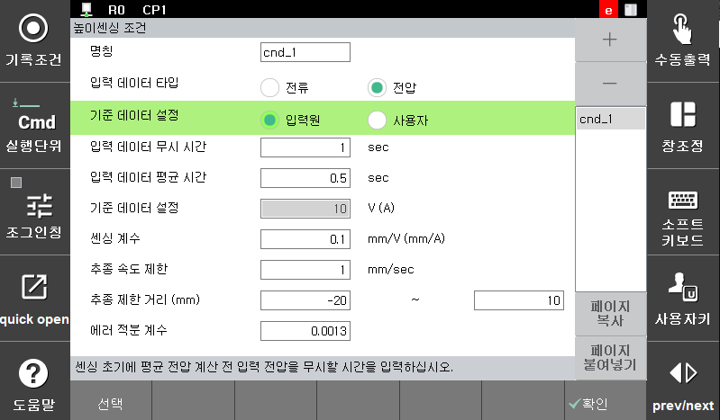

# 8.4.1 높이센싱 조건

```heightsen on,cnd= ``` 명령어에서 [quick open] 키를 눌러 『높이센싱 조건』설정화면으로 진입합니다. 조건설정 화면은 아래 그림과 같습니다.

 
<p align="center">
 </img>
 <em><p align="center">그림 8.17 높이센싱 조건 대화상자</p></em>
</p>

---

각 항목별 설정 및 조작방법은 다음과 같습니다.

(1)	조건번호: [1 ~ 8]  
    높이센싱 조건번호를 설정합니다.

(2)	높이 센싱 용 입력데이터 종류  
    입력데이터 종류를 표시합니다. GMAW 는 용접 전류를 TIG 용접은 용접 전압을 사용합니다.

(3)	기준 데이터 설정 방법: <평균 입력 데이터, 사용자 입력 데이터>  
    기준 데이터를 설정하는 방법을 선택합니다.
-	평균 입력 데이터: 센싱 초반 기준데이터 평균값을 기준으로 설정
-	사용자 입력데이터: 사용자가 기준데이터를 직접 입력

(4)	입력 데이터 무시 시간: [0.0 ~ 5.0]  
    용접 초기의 불안정한 상태에서 입력 신호를 무시하는 시간입니다. ‘평균 입력 데이터’로 기준데이터를 설정하는 경우 이 시간 지정된 시간동안 평균값으로 기준값을 계산합니다. ‘사용자 입력 데이터’를 기준으로 사용하는 경우 바로 높이센싱이 동작합니다.

(5)	입력 데이터 평균시간: [0.5 ~ 10.0]  
    센싱 기준 데이터를 계산하기 위해 입력 데이터 평균을 계산하는 시간을 설정합니다. 기준 데이터 설정 방법에서 ‘평균 입력 데이터’를 선택하는 경우 표시됩니다. 정확한 기준 높이 산정이 안 되어 있는 경우

(6)	입력 데이터 무시 시간: [0.0 ~ 5.0]  
    용접 초기의 불안정한 상태에서 입력 신호를 무시하는 시간입니다. ‘평균 입력 데이터’로 기준데이터를 설정하는 경우 이 항목이 표시됩니다. 이 시간 지정된 시간동안 평균값으로 기준값을 계산합니다. 

(7)	기준 데이터 설정: [-500.0 ~ 500.0]  
    높이센싱의 기준값을 사용자가 직접 입력하는 항목입니다. ‘사용자 입력 데이터’로 기준데이터를 설정하는 경우 이 항목이 표시됩니다.

(8)	높이 센싱 계수: [-100.0 ~ 100.0]  
    입력된 데이터 차이에 대비되는 거리 계수입니다. 이 값이 작아지면 입력 데이터에 따른 추종량이 작아져서 부드럽게 추종합니다. 이 값이 커지면 추종이 빨라지지만 궤적 상 상하 진동이 발생할 수 있습니다.

(9)	센싱에 의한 추종속도 제한값: [0.1 ~ 10.0]  
    1초동안 센싱으로 추종하는 최대값을 설정합니다. 이 값이 작아지면 추종이 부드러워지며 커지면 추종이 빨라집니다.

(10) 노이즈 민감도  
    입력 데이터의 노이즈에 대한 민감도를 설정합니다. 비활성화 되어 있는 경우 지원하지 않는 버전입니다.

(11) 추종오차 적분 계수: [0.0 ~ 10.0]
    높이 센싱의 추종 성능 중 지속적인 에러값에 대한 보정량을 설정합니다. 0보다 큰 값이 설정되면 추종 성능이 향상되지만 지나치게 커지면 궤적 진동이 발생합니다. 아주 작은 값부터 적용하여 현장에 적정한 값을 선정하십시오.

(12) 초기 기준 데이터: [-500.0 ~ 500.0]
    용접 초반에 별도의 기준 데이터를 적용하려고 할 때 설정합니다. 입력 데이터 무시 시간이 지난 후 ‘초기설정된 시기준 데이터 적용 시간’에서 설정된 시간동안 이 기준 데이터를 이용하여 높이 센싱이 수행됩니다.

(13) 초기 기준 데이터 적용 시간: [0.0 ~ 10.0]  
    초기 기준 데이터로 높이 센싱을 수행할 시간을 설정합니다. 이 시간이 지난 후에는 ‘기준 데이터 설정’ 항목에서 입력한 데이터로 높이센싱이 수행됩니다.

(14) 입력 데이터 평균 시간: [0.5 ~ 10.0]  
    기준데이터 설정방법이 Average input data(입력데이터 평균)인 경우 표시되는 항목입니다. 입력 무시시간이 지난 후 기준데이터 계산을 위해 입력데이터를 평균하는 시간입니다.

(15) 기준 데이터 설정: [-500 ~ 500]  
    기준데이터 설정방법이 User input data(사용자 입력데이터)인 경우 표시되는 항목입니다. 입력 무시시간이 지난 후 기준데이터 계산을 위해 입력데이터를 평균하는 시간입니다.

(16) 높이 센싱 계수: [-100.0 ~ 100.0]  
    데이터 추종량을 계산하는데 사용하는 센싱 계수를 설정합니다. 이 값이 크면 보정할 거리가 증가하므로 추종 속도가 증가하고 진동이 발생할 수 있습니다. 이 값이 작으면 추종 속도가 감소하지만 진동이 작아집니다. 
    이 값이 0으로 설정되면 높이센싱기능이 동작하지만 위치추종은 수행하지 않고 데이터만 입력 받습니다. 센싱을 위한 기준데이터를 얻기 위한 경우 사용하십시오.

(17) 센싱에 의한 추종속도 제한치: [0.001 ~ 5.0]  
    초당 추종 거리 제한치를 설정합니다. 이 값은 로봇의 급격한 추종을 제한하기 위하여 설정합니다. 이 값이 크면 추종 속도가 증가하고 진동이 발생할 수 있습니다. 이 값이 작으면 로봇의 추종가능 거리가 감소하지만 진동이 작아집니다. 

(18) 높이 센싱 범위: [-300.0 ~ 0.0], [0.0 ~ 200.0]  
    높이센싱의 총 추종거리 제한치를 설정합니다.
