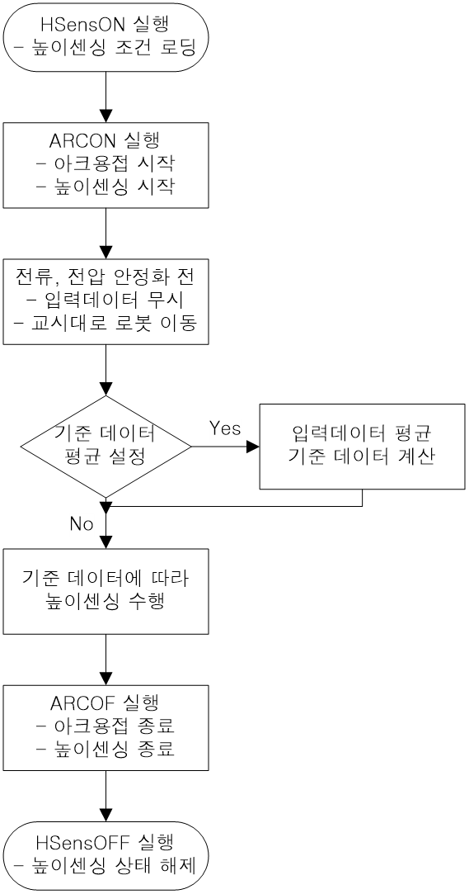

# 8.4 높이센싱(Height Sensing) 기능

본 기능은 TIG 용접과 같이 로봇의 툴이 작업물에서 일정한 거리를 유지해야 하는 경우에 사용하는 기능입니다. TIG 용접의 경우에는 높이가 Arc길이와 비례하므로 AVC(Arc Voltage Control)기능이라고 합니다. 작업물과의 거리는 센서에 의한 아날로그 전압입력, 용접기에서 감지하는 Arc 길이 보정용 파라미터, 용접 전류나 전압 값에 의해 조정됩니다.

본 기능의 사용을 위해서는 센싱 기능을 위한 데이터 입력 설정을 ‘유효’로 선택해야 합니다.
센싱 기능을 위한 데이터 입력 설정의 세부 내용은 ‘1.3 Arc 용접 응용 조건 설정’을 참고하여 주십시오.

센싱 기능용 입력데이터의 설정이 완료된 후에는 하기와 같은 절차를 통하여 높이센싱 기능을 사용할 수 있습니다.

(1)	명령어 입력

높이센싱 시작을 위해서 heightsen on, cnd=1 명령을 사용합니다. 명령어에는 뒤에는 조건번호를 입력합니다. 높이센싱 조건은 총 8개가 있습니다.
높이센싱 종료를 위해서 heightsen off 명령을 사용합니다. 종료 명령어는 특별히 인수를 필요로 하지 않습니다.

높이센싱용 명령어가 입력된 작업프로그램의 예시는 다음과 같습니다.

```python
    S1   move L,spd=100%,accu=1,tool=0
    S2   move L,spd=20%,accu=1,tool=0
    S3   move L,spd=100mm/s,accu=1,tool=0
         heightsen on, cnd=1		  # 높이센싱 시작
         arcon cnd=2		       # Arc 용접 시작
    S4   move L,spd=10mm/s,accu=1,tool=0
         arcoff			       # Arc 용접 종료
         heigghtsen off			  # 높이센싱 종료
    S5   move L,spd=20%,accu=1,tool=0
         END 
```

(2)	높이센싱기능 동작순서

높이센싱은 명령어 실행 후 ```arcon``` 명령어가 실행되면 동작하기 시작합니다. 일반적으로 용접 초기에는 전류, 전압이 안정화되지 않은 상태이므로 안정화 될 때까지는 입력데이터를 무시합니다. 이후 입력데이터가 안정화되면 기준데이터 설정방식에 따라 평균을 계산합니다. 사용자가 기준데이터를 입력하는 방식인 경우는 바로 높이센싱을 수행하게 됩니다.

 
높이센싱의 동작 순서는 다음과 같습니다.

 
<p align="center">
 </img>
 <em><p align="center">그림 8.17_0 높이센싱 기능 동작 순서</p></em>
</p>

