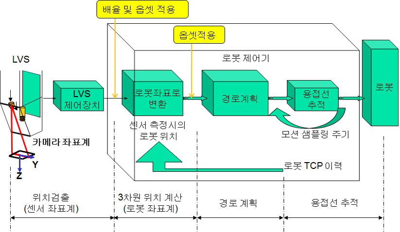
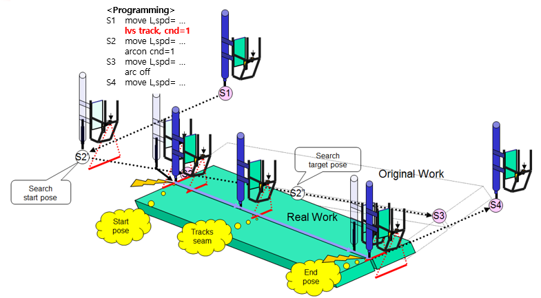

# 8.5 LVS(Laser Vision Sensor) 용접선 추적 및 검출 기능

본 기능은 LVS로 용접선을 인식하여 환경에 따라 변경된 용접선을 검출하고 추적하여 안정적인 용접 품질을 제공합니다. LVS는 로봇의 토치 부근에 설치되어 용접하고자 하는 대상을 인식하고, 해당 정보를 로봇에 보냅니다. 로봇은 해당 정보를 이용하여 로봇의 툴 끝을 인식된 위치로 이동시킵니다. 그래서 용접 대상물의 위치가 변하여 기존 교시점에서 용접이 불가능할 경우에도 용접 시작점으로 로봇의 툴 끝을 이동시켜 정확하게 용접을 시작할 수 있습니다.
또한 용접 중에도 LVS는 지속적으로 용접선을 인식하고, 인식한 용접선 정보를 로봇으로 보내 로봇이 용접선을 따라 정확하게 용접할 수 있도록 합니다. 본 기능은 용접 대상물의 위치 변화가 빈번하거나 용접선이 균일하지 않을 경우에도 안정적인 용접 품질을 얻을 수 있습니다.

<p align="center">
 </img>
 <em><p align="center">그림 8.18 LVS 용접선 추적 데이터 흐름도</p></em>
</p>

</br>

LVS 용접선 추적 및 검출 기능은 ```lvs``` 명령어로 사용할 수 있습니다. 기능의 환경 설정 및 세부사항은 ‘LVS 용접선 추적 및 검출 기능설명서’를 참고하시기 바랍니다. 본 기능은 엔지니어의 도움을 필요로 하는 옵션 기능으로 사용을 위해서는 당사에 문의하시기 바랍니다.

<p align="center">
 </img>
 <em><p align="center">그림 8.19 LVS 용접선 추적을 위한 명령어 실행</p></em>
</p>