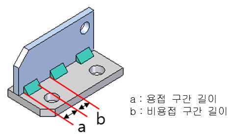
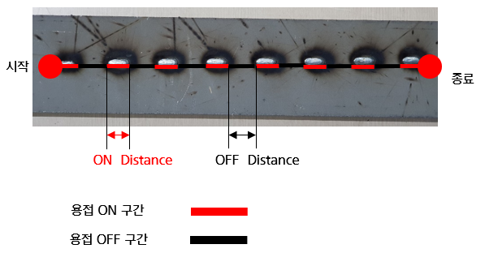
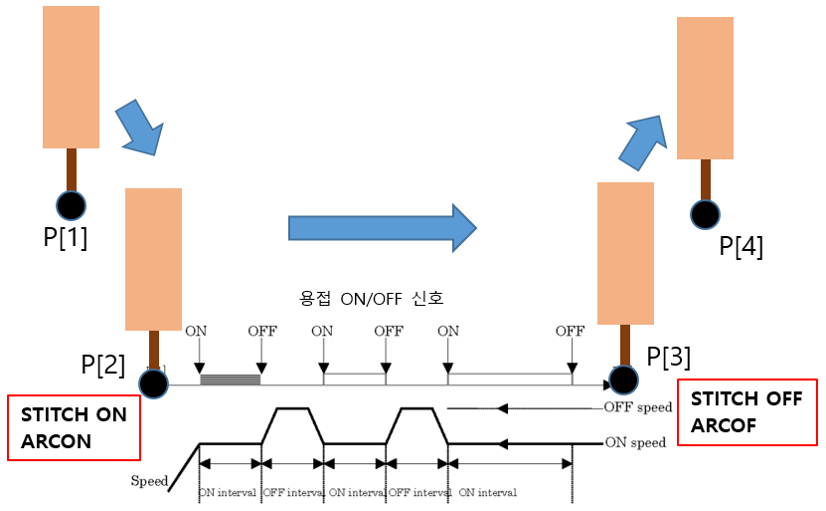

# 8.6.1  STITCH 기능 개요
 
스티치 용접을 바느질 하는 것 처럼 띄엄띄엄 용접하는 기능입니다. 그림 8.17 시편에 시작점과 종료점을 설정하여 스티치 용접을 한 모습입니다. 스티치 용접에서 그림 8.16과 같이 파라미터 a와 b를 설정하여 용접구간과 비용접 구간의 길이를 설정하여 스티치 패턴의 용접을 진행합니다.
그림 8.18에서 간단하게 스티치 용접의 프로세스를 설명 합니다. P[1]위치에서 P[4] 위치까지 위치를 기록합니다. 이 그림에서는 P[2]와 P[3] 구간에서 스티치 용접을 진행하며 사용 명령어로 ```stitch on/off```와 ```arcon/arcoff``` 명령어를 사용하였습니다.

</br>

<p align="center">
 </img>
 <em><p align="center">그림 8.20 스티치 기능 기본 파라미터</p></em>
</p> 

</br>


<p align="center">
 </img>
 <em><p align="center">그림 8.21 스티치 용접 시험 시편</p></em>
</p> 
 
</br>


<p align="center">
 </img>
 <em><p align="center">그림 8.22 스티치 용접 프로세스</p></em>
</p> 


 


