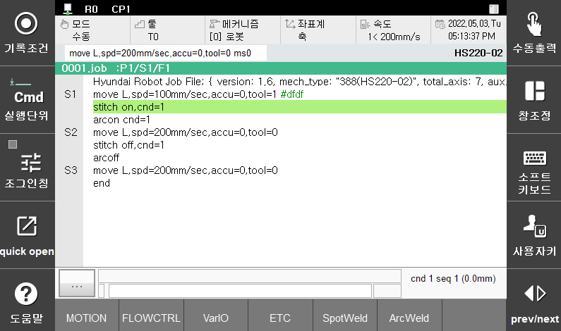

# 8.6.2 stitch 명령어 작성 
 

<p align="center">
 </img>
 <em><p align="center">그림 8.23 스티치 명령어 작성 예시</p></em>
</p>  


```stitch``` 명령어 입력
1.	명령입력 → 2. 아크 → 3. stitch (onf/off 선택 후 ENTER[YES] 버튼 클릭)



[**주의**]  
- ```S3 move L, spd=10mm/s, accu=3, tool=1```  
	 - L : 반드시 직선 보간을 선택  
	 - 10mm/s : 용접 속도, Stitch 용접의 ON 구간에서 속도, 반드시 단위를 mm/s로 선택
- ```arcon / arcoff``` 명령어 함께 사용 → 용접 
