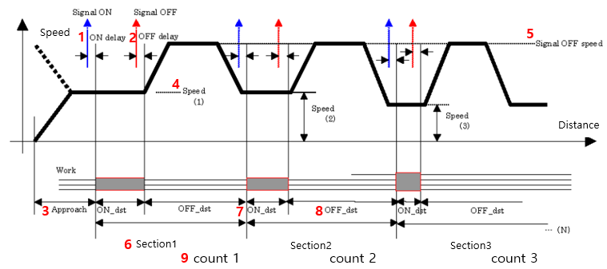
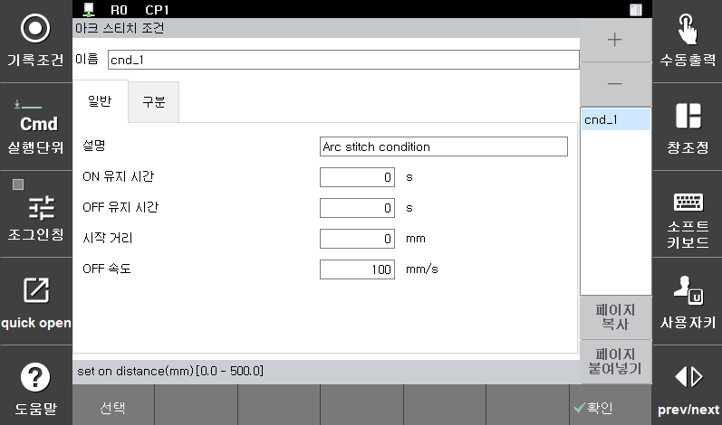
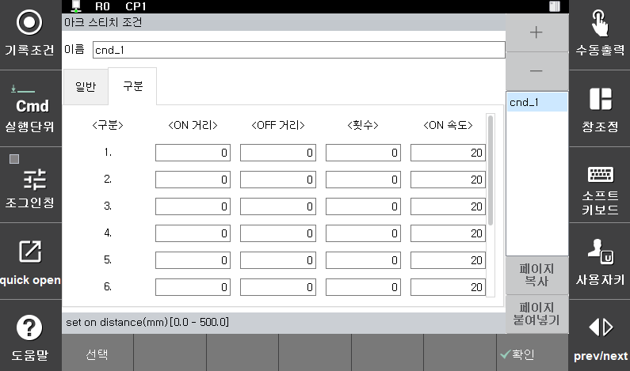
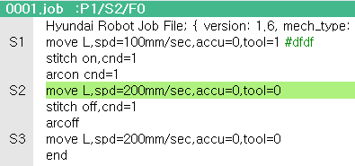

# 8.6.3 stitch 기능 Prameter 설정


<p align="center">
 </img>
 <em><p align="center">그림 8.24 스티치 용접 과정에 따른 Profile</p></em>
</p>


그림 8.21은 ```stitch``` 명령어에서 [quick open] 버튼을 눌러서 접근하는 화면이고, 그림 8.22은 그림 8.21화면에서 '구분' 버튼으로 접근합니다. 그림 8.23은 Job 프로그램 화면입니다.
그림 8.21 – 8.22 의 파라미터에 대한 설명은 다음과 같습니다.

- 조건 번호 : Shift + 방향키로 선택  
- 설명 : 소프트 키보드로 입력
  - (1) On 신호 지연 시간 : 용접 신호가 미리 켜지는 시간
  - (2) Off 신호 지연 시간 : 용접 신호가 미리 꺼지는 시간
  - (3) STITCH 준비 거리 : Stitch 시작 전 On구간 속도 진입 구간 길이
  - (4) ON 속력 : 용접 구간 용접 속력
  - (5) OFF 속력 : 비용접 구간 용접 속력
  - (6) Section : Stitch 용접 조건  
Ex) section1 조건의 stitch 용접이 해당 count만큼 진행되면 section2의 조건에 해당하는 stitch 용접이 진행
  - (7) ON_dst : 용접 구간 길이
  - (8) OFF_dst : 비용접 구간 길이
  - (9) Count : Stitch 용접 횟수
Stitch Enable/Equipment Enable/Equipment Output
→ 3가지 파라미터에 1이 입력되어야 playback에서 stitch 용접이 진행됨



[**주의**]  
- (4) ON 속력 : Stitch 구간에서 용접(ON) 구간의 속도 설정은 스텝 속도로 지정
- (7) ON_dst, (8) OFF_dst, (9) Count 모두 입력 되어야 section2의 조건을 입력할 수 있음
- (10) STITCH enable Port, (11) Equipment enable Port, (12) Equipment Output Port 모두 1을 입력해야 playback에서 stitch 용접이 됨. 그렇지 않을 경우 stitch 모션만 진행됨(용접X)



<p align="center">
 </img>
 <em><p align="center">그림 8.25 스티치 용접 조건 대화상자1</p></em>
</p>

<p align="center">
 </img>
 <em><p align="center">그림 8.26 스티치 용접 조건 대화상자2</p></em>
</p>

<p align="center">
 </img>
 <em><p align="center">그림 8.27 스티치 용접 명령어 입력</p></em>
</p>
 

