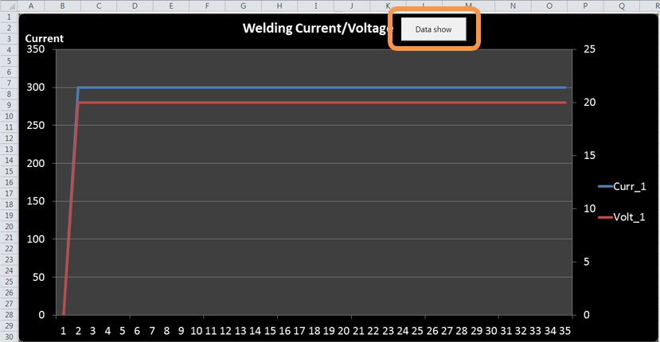
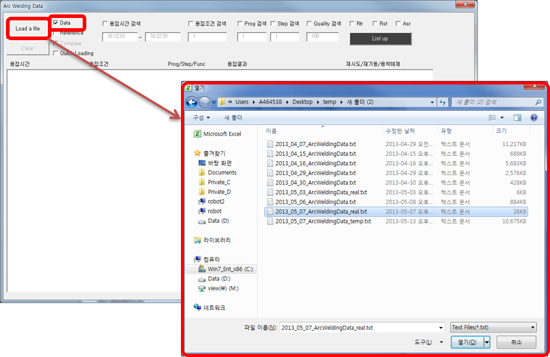
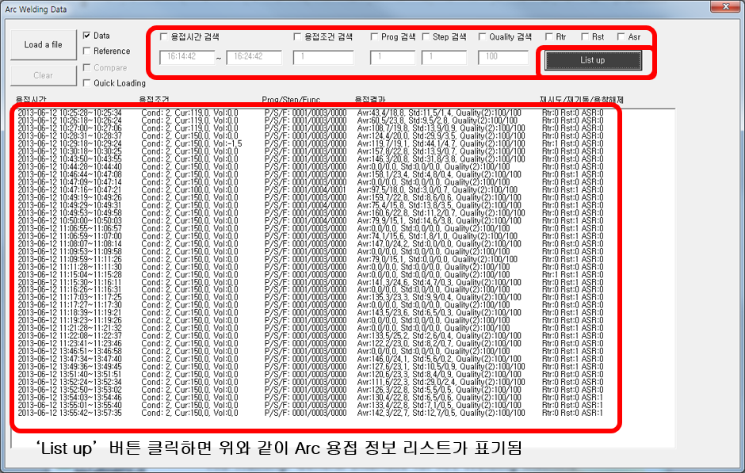
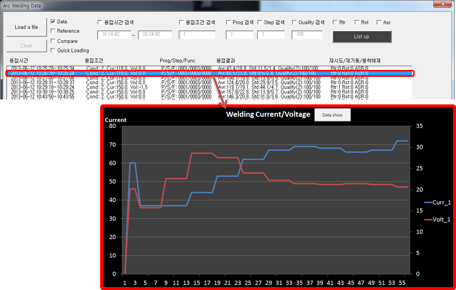

# 9.1.1 기본기능

(1) 대화상자 띄우기

- 	‘xlsm’ 파일을 연 후 ‘Drawing Graph’ 버튼을 클릭.  
-	클릭 후 ‘Arc Welding Data’ 대화상자가 띄워짐.

 </img>
 <em>
그림 9.1 용접 데이터 그래프
</em>

(2) Arc 용접 데이터 파일 선택

-	‘Data’를 체크한 후 ‘Load a file’ 버튼을 클릭.  
-	아래와 같이 확인하고자 하는 Arc 용접 데이터 파일을 선택.  

 </img>
 <em>
그림 9.2 용접 데이터 파일
</em>

(3) 검색 조건 설정

-	원하는 검색 조건을 입력. (미입력 시 전체 용접 데이터를 불러옴)
-	‘List up’ 버튼을 누르면 아래와 같이 용접 정보가 표기됨.

 </img>
 <em>
그림 9.3 용접 정보 리스트
</em>

(4) 데이터 선택

-	표기된 리스트 중 하나를 선택.
-	엑셀의 그래프에 해당 용접 그래프가 표기됨

 </img>
 <em>
그림 9.4 용접 데이터 선택
</em>

