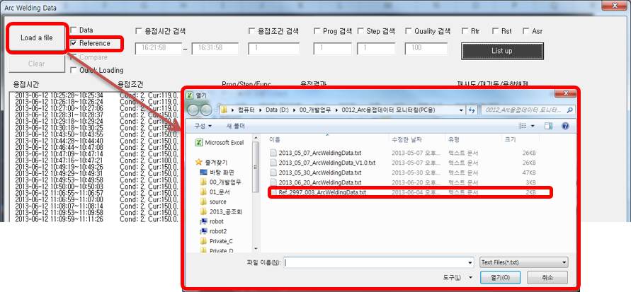
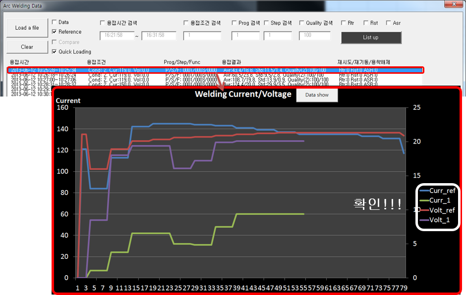

# 9.1.2 기준 파일

(1) 기준 파일 선택

- ‘Reference’ 체크 후 ‘Load a file’ 버튼을 클릭.
- 띄워진 대화상자에서 확인하고자 하는 기준 파일을 선택.
- 선택 시 기준 파일의 그래프가 그려지고, 다른 데이터와 비교하기 위해 고정됨

 </img>
 <em>
그림 9.5 기준 파일 선택
</em>

(2) 비교할 데이터 선택

-	기준 그래프가 고정된 상태에서 리스트의 데이터를 선택하면 선택된 데이터와 기준 데이터를 비교할 수 있게 그래프에 표기됨

 </img>
 <em>
그림 9.6 비교 데이터 선택
</em>

