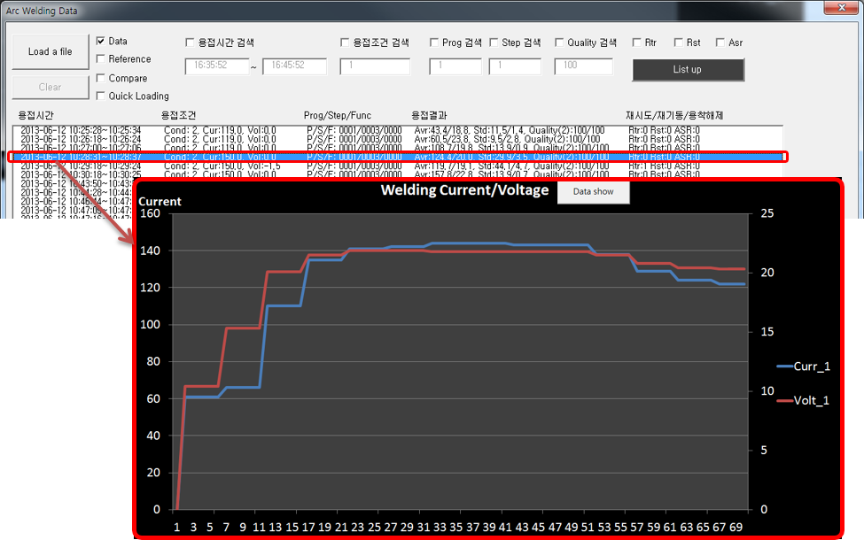
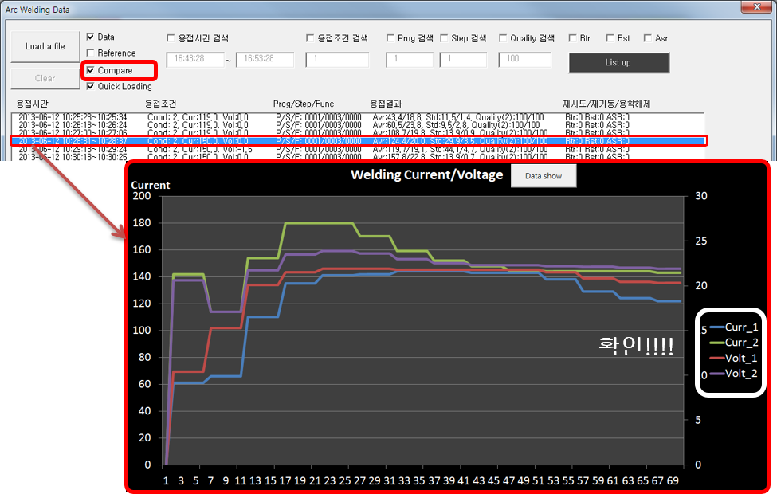

# 9.1.3 비교 기능

(1) 첫번째 데이터 선택

-	기준 데이터가 아닌 일반 데이터를 비교 대상으로 고정하는 기능
-	‘Clear’ 버튼을 누르기 전까지 계속 비교 모드로 동작함
-	리스트에서 고정될 첫번째 데이터 선택

 </img>
 <em>
그림 9.7 첫 번째 데이터 선택
</em>

(2) 두번째 데이터 선택

-	‘Compare’를 체크 후 비교할 대상인 두번째 데이터를 리스트에서 선택.
-	선택 시 엑셀 그래프에 두 데이터를 비교한 결과가 표기.

 </img>
 <em>
그림 9.8 두 번째 데이터 선택
</em>

